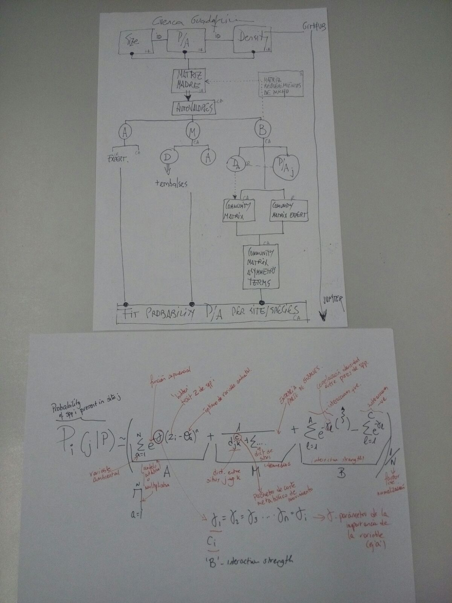

## AIM

* Coexistence of native-exotic communities in disturbed dendritic networks

## QUESTIONS

* What determines coexistence of native fish species within a "Pristine" Mediterranean (environmentally constrained) dendritic network? 

* How is the community dynamics and -ultimately - composition affected by the introduction of dams (large obstacles to connectivity) and exotic species? 

* Does the native community change when dams and/or exotics are introduced? 

* What is the probability of extinction  of native species after exotics have been introduced, and what (local) factors can increase that probability?

* Asymmetric basin (current species assemblages are very different in right vs. left hand margin), does it play a role in the dynamics of coexistence?

## TODO

## Working draft

* https://de.sharelatex.com/project/5ac1f0c58dd6a14ec01055e3

## DATA

* https://drive.switch.ch/index.php/s/rNd3V73S2ca6MkT

## CODE 

* GuadeX/Model/Code/dendritic.m

## OUTPUTS

Modeling Probability co-occurrence accounting for abiotic, biotic, migration and dendritic topology

## CHECK

## DATA FOLDERS
 
* https://www.dropbox.com/sh/fndht5q3bxoyv05/AADjAs5uQrO5V4SnjvJC3pEZa?dl=0
 

