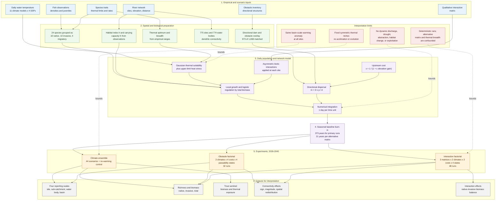

# Warming, Fragmentation and Biotic Structure in a Mediterranean Fish Metacommunity

## An integrated synthesis of the climate-sensitivity and obstacle/interaction-sensitivity experiments (Guadalquivir basin, 2026–2045)

**Document type:** Integrated analytical report (synthesis of completed, read-only simulation outputs)
**Model:** GuadeX spatially explicit dendritic metacommunity ODE, 775 sites, 24 species, 2026–2045, per-site daily water temperature, 373-year converged baseline burn-in, heat-stress slope `k = 3.7817692640400324e-5`, effective carrying capacity `K = 1× observed`, obstacle `overlay` mode.
**Evidence streams synthesised:** (i) the 44-run climate-scenario ensemble `results/climate_scenarios_k1x_burnin/`; (ii) the obstacle/interaction sensitivity sweeps `results/sensitivity_obstacles/` (32 runs) and `results/sensitivity_obstacles/alt_interactions/` (48 runs).
**Status:** Synthesis only. No simulation was executed for this report and no file under `results/` was modified; all quoted quantities are read from the existing CSV exports and the authoritative summaries cited in Section 5.

---

## 1. Executive Summary & Broad Context

### 1.1 Regional setting

The Guadalquivir is one of the largest and most hydrologically regulated river basins in Mediterranean southern Europe and a recognised stronghold of Iberian freshwater endemism. Its fish assemblage combines a high proportion of Iberian endemics (cyprinids and cobitids with narrow thermal and hydrological tolerances), a cold-water salmonid — brown trout (*Salmo trutta*, code **ST**) — that persists at the warm, southern edge of its European range, and a substantial invasive component. The modelled system represents this as **775 sites / 774 water bodies within a single basin (`ES050`)** arranged as a **dendritic river network**, with **24 fish species** classified as **10 native residents** (`AB, AH, SP, PW, LS, SA, IL, CP, IO, ST`), **10 invasive** (`GH, MS, LG, CC, CG, AM, OM, EL, GL, TT`) and **4 migratory/diadromous** (`AA, AAL, LR, MC`, reported separately and excluded from the native richness metric). Two stressors dominate current management concern in such basins and are the two axes of this synthesis:

1. **Thermal change.** Mediterranean river networks are warming, and the summer thermal maximum — not the annual mean — is the physiologically decisive variable for native fish. In this model the forcing is therefore a **per-site daily water-temperature series**, so that the annual integration resolves the summer thermal bottleneck. Warming is expressed as an anomaly against the fixed **1986–2005** baseline and applied over the **2026–2045** horizon.
2. **Habitat fragmentation and barriers.** The basin carries a dense inventory of obstacles; the obstacle overlay uses the 2026 inventory, in which **973 of 1,658 obstacles** are spatially matched to a modelled network segment within a 2,000 m tolerance. Matched segments limit upstream passage to a base passability of 0.1 and downstream passage to 0.5. Fragmentation is additionally modulated by an **upstream migration cost** `c` (the exponent in `x_ij = 1/(1 + c·Δe)` for upstream movement), which sets how strongly elevation gain suppresses upstream dispersal regardless of barriers.

Warming and fragmentation are not independent: the ability of populations to track a shifting thermal niche by dispersal is itself set by network connectivity. This report therefore treats the two stressors as a **coupled thermal–hydraulic system**, not as two separate stressors added together.

### 1.2 The two evidence streams and their headline conclusions

**Stream A — Climate sensitivity (44 scenario runs: 11 GCMs × 4 SSPs, plus one no-warming control).** The converged-baseline design makes the control essentially stationary (total biomass +0.08 % over 20 years; native biomass +0.10 %; native richness −0.57 %, interpreted as threshold flicker; these are the k1x `control/baseline` values from the CSV and the results report — the companion biological report's +0.65 % control-drift figure is a stale pre-`k1x` value), so 2026–2045 changes can be read against a fixed baseline rather than against a colonisation transient. Over this window the ensemble delivers only early warming: **added basin-mean warming by 2045 is +0.74 °C (SSP1-2.6), +0.87 °C (SSP2-4.5), +0.88 °C (SSP3-7.0) and +0.97 °C (SSP5-8.5)**, and even the strongest single GCM × SSP run reaches only ≈ +1.37 °C basin-mean (per-site maxima are larger; the two sweep ends reach 0.856 °C and 1.852 °C per-site maximum, see §4.5 and §5.4). Against that forcing:

- **Total basin biomass declines by −0.120 per °C (R² = 0.25; 44 scenario runs)** — a change of order 0.13 % of the ≈92.7 units per site at the extremes, i.e. a consistent but ecologically small negative trend (no formal test was applied).
- **Native richness is essentially flat: −0.00071 species per site per °C (R² = 0.02).** The richness-loss indicator is also flat (+0.00015 per °C, R² = 0.01) and never exceeds ≈0.9 % in any run. No scenario ranking is defensible: the across-GCM spread overlaps the between-scenario differences.
- **The mechanism is community maladaptation, not tolerance.** The dominant native cyprinids have thermal optima of 19–20 °C against a basin mean of ≈16.0 °C, so warming moves them *towards* their optima; only ST (optimum 12.0 °C, already ≈1.5σ on the warm side of its optimum) is penalised. This is why the aggregate community signal is near-zero while a strong species-level signal exists.
- **The one large, interpretable climate response is the cold-water specialist ST:** basin biomass declines by **−9.0 % (SSP1-2.6) to −10.9 % (SSP5-8.5)** versus a control of **−0.2 %**, with the median occupied-site population falling to 68–92 % of its 2026 value. This establishes ST as the sentinel taxon for thermal–hydraulic coupling (§3.1).

**Stream B — Obstacle / interaction sensitivity (32-run obstacle sweep + 48-run alt-interaction sweep).** Within this stream the factor ranking by mean rank across eight metrics is:

**interaction matrix (1.88) > upstream cost (3.00) ≈ thermal sigma (3.12) > passability (3.62) > passability × upstream cost (4.38) > climate model (5.00) > passability × temperature (7.00).**

The within-sweep variance decompositions sharpen this:

- For **basin native biomass** in the obstacle sweep, the **upstream cost** main effect explains **SS = 0.578**, the **passability × upstream-cost interaction SS = 0.242**, passability **SS = 0.155** and climate model only **SS = 0.026**. Aggregate native biomass is therefore controlled primarily by *how costly upstream movement already is*, not by barrier state alone and hardly at all by the ~1 °C climate contrast.
- For **ST final biomass**, the ordering reverses: **climate model SS = 0.886**, passability **SS = 0.090**, upstream cost **SS = 0.011**. The sentinel species is climate-dominated; the aggregate is hydraulically dominated.
- In the alt-interaction sweep, the **interaction matrix explains SS = 0.998** of basin native biomass — but this axis is structural, deliberately extreme and confounded (§2.3, §6). The deliberately **invasive-favouring** matrix collapses native biomass by ≈90 % (reference run ≈51.0 → 5.2 model units; pooled mean ≈50.2 → 5.1) and ST final biomass by 43–45 % (reference run ≈575 → 314; pooled mean ≈548 → 313), while the **`random` matrix is a placebo** whose relative ratios are meaningless.

### 1.3 Integrated headline conclusion

For the 2026–2045 horizon and this model structure, **aggregate native biomass and richness are first-order controlled by network hydraulics and interaction structure, and only marginally by ~1 °C of warming**; **warming acts strongly but narrowly on the cold-water sentinel ST**, whose decline is already visible under the mildest scenario. **Passability is not monotonic**: the effect of blocking barriers changes sign with background upstream cost (see §2.2), so connectivity restoration cannot be assumed to benefit native biomass. The single most important caveat is that the largest-ranked axis (interaction matrix) is a **confounded, deliberately perturbed structural contrast, not an empirical uncertainty estimate**, and the second-tier factors are themselves non-orthogonal. All conclusions are descriptive; no formal significance testing was performed, and biomass is reported in model units.

---

## 2. System-Level Interactions

### 2.1 The two dynamical drivers

**Thermal driver.** The local dynamics are

$$\frac{dN_{i,s}}{dt} = N_{i,s}\Big(r_s\,W_{i,s}\,\big(1-\tfrac{\sum_j N_{i,j}}{K_i}\big) + \tfrac{\sum_j \alpha_{sj}N_{i,j}}{K_i} - m^{\text{heat}}_{i,s}(t)\Big) + \sum_{j\in \text{nb}(i)} (m_{ji}^s N_{j,s} - m_{ij}^s N_{i,s}),$$

with thermal suitability `W = exp(−(T_i − opt_s)²/2σ_s²)·h_i` and heat-stress mortality `m_heat = k·max(0, T_i − T_up,s)²` active only above the species' empirical upper limit. Warming therefore acts through two distinct channels: it **rescales growth** (Gaussian thermal filter) and, above the limit, it **adds mortality** (quadratic heat stress). The heat-stress slope `k = 3.7817692640400324e-5` was calibrated so that the worst baseline species/site loses no more than 5 % yr⁻¹.

**Hydraulic driver.** Dispersal is `m_ij = D_median · x_ij · p_ij / d_ij`, where `x_ij = 1` downstream and `x_ij = 1/(1 + c·Δe)` upstream, and `p_ij` is the directional obstacle/dam passability. The **upstream cost `c`** is thus a global property of the network's hydraulic resistance, while **passability** is a local property of individual restricted links. Matched obstacle segments have base upstream passability 0.1 and downstream passability 0.5; the sweep multiplies every restricted link by a scenario factor: **baseline = 1.0, improved = 1.5, reduced = 0.5, blocked = 0.1** (capped at full passage).

### 2.2 The sign-flipping passability × upstream-cost interaction

The passability × upstream-cost interaction is a genuine, reproducible feature of the obstacle sweep, not noise. Using the coolest climate end (SSP1-2.6 / IITM-ESM), the **blocked − baseline** difference in basin native biomass is:

| upstream cost `c` | 0.01 | 0.05 | 0.10 | 0.50 |
|---|---:|---:|---:|---:|
| Δ native biomass (blocked − baseline) | **−0.349** | −0.009 | +0.146 | **+0.442** |

and the two climate extremes agree on the pattern (SSP2-4.5 / UKESM1-0-LL: −0.336, +0.001, +0.156, +0.453). The interaction is the second-largest term in the native-biomass decomposition (SS = 0.242) and has a median standardised magnitude of **1.42σ** for native biomass and **1.24σ** for the ST quasi-extinct fraction. The same reversal appears for `reduced_passability` (−0.101 → +0.371, SSP1-2.6), while `improved_passability` is **negative at every upstream cost** (−0.034 at `c`=0.01 to −0.407 at `c`=0.5).

Two implications follow. First, **the ecological sign of a barrier is conditional on background connectivity**: when the network is already cheap to ascend (`c` small), closing a link removes native biomass; when the network is already hydraulically expensive (`c` large), further restriction is associated with *higher* basin-aggregate native biomass. Second, in this model **additional connectivity does not benefit the native aggregate** — `improved_passability` lowers basin native biomass relative to baseline throughout, consistent with the invasive component being the stronger beneficiary of restored movement (invasive-biomass upstream-cost SS = 0.970). The mechanistic attribution (differential upstream colonisation by competitive invasives versus changes in native emigration loss) cannot be separated from these descriptive outputs; what is robust is the **non-monotonicity** itself, which invalidates any management heuristic that treats passability as "more is better".

> **Numerical reconciliation.** `REPORT_FIGURES.md` summarises the low-cost end of this interaction as −0.29; the underlying `runs_index.csv` gives −0.349 for SSP1-2.6 / IITM-ESM at `c` = 0.01 (basin native biomass, blocked − baseline). This report uses the CSV value, −0.349, throughout. All other interaction figures cited here agree between the two documents.

### 2.3 The dominant-but-confoundable interaction-structure axis

The **interaction matrix** is the top-ranked factor by mean rank (1.88) and by mean normalised effect (0.871), with SS = 0.998 for basin native biomass and SS = 0.982 for ST final biomass in the alt sweep. It must not be read as an estimate of empirical uncertainty, because three things are true at once:

1. **It is a deliberately extreme structural contrast.** The rank-1 position is produced almost entirely by the **invasive-favouring** matrix (natives suppressed by invasives at −0.8; natives exert no effect on invasives; native–native −0.1; invasive–invasive −0.3), which drives pooled native biomass from ≈50.2 to 5.1 (−90 %) and pooled ST from ≈548 to 313 (−43 %); in the matched reference run (SSP1-2.6 / IITM-ESM, `c` = 0.01, baseline passability) the corresponding values are ≈51.0 → 5.2 and ≈575 → 314 (−45 %). The empirical **original** matrix and the placebo are comparatively close to one another.
2. **It is fully confounded with the sweep and with burn-in.** The σ = 0.3 contrast is not an independent factor: it is implemented only in the alt sweep, which used a **21-year** burn-in rather than the **373-year** converged burn-in used everywhere else. The measured "σ effect" (native biomass −36.9 % to −38.8 %; ST final biomass −27.0 % to −30.3 %, from `parameter_effect_rank.csv`; the summary `REPORT_FIGURES.md` quotes the rounded −35.6 % to −38.6 % and −26 % to −29 %; mean rank 3.12) is therefore a **confounded contrast** between two differently equilibrated ensembles.
3. **Its placebo arm is uninterpretable in relative terms.** The `random` matrix (uniform off-diagonal draws in [−1, 0], fixed seed) produces near-zero burn-in baselines for some species, so relative ratios explode and are capped at 500 % in the effect table. Rankings use standardised absolute effects; the `random` ratios carry no ecological information.

The defensible statement is therefore: **interaction structure is the largest potential control on native biomass in this model, but its measured magnitude is an upper bound set by a deliberately extreme perturbation, entangled with a thermal-breadth manipulation and a shorter spin-up.** Figure 13 makes the resulting redistribution explicit: relative to the original matrix, the invasive-favouring matrix drives native biomass from ≈50.2 to 5.1 and ST from ≈548 to 313 while invasive biomass rises from ≈6.0 to 58.7, so total biomass is nearly conserved (≈56.2 to ≈64.2) — the axis reallocates biomass among compartments rather than removing it.

### 2.4 Where climate, cost and passability actually bite

The two streams converge on a clean division of labour:

| Response | Dominant control (with evidence) | Climate role |
|---|---|---|
| Basin total biomass | upstream cost (SS = 0.961) | negligible (SS = 0.006) |
| Basin native biomass | upstream cost (SS = 0.578); passability × cost (0.242); passability (0.155) | small (SS = 0.026) |
| Basin native richness | upstream cost (SS = 0.947) | negligible (SS ≈ 1e-6) |
| Invasive biomass | upstream cost (SS = 0.970) | negligible |
| **ST final biomass** | **climate model (SS = 0.886)**; passability (0.090) | **dominant** |
| Passability × temperature | rank 7 (mean rank 7.00; median ≤0.15σ on all metrics, the sole exception being the saturated ST quasi-extinction flag, max 1.24σ) | passability effects stable across the two climate ends |

The **non-orthogonality** of the combined design is important and is stated explicitly: each sweep is internally a balanced full factorial (obstacle 2 × 4 × 4; alt 3 × 2 × 2 × 4), so each within-sweep sum-of-squares decomposition is valid; **across** sweeps, however, the thermal-sigma level, the interaction-matrix axis and the burn-in length are not independently manipulable, and the 44-run temperature ensemble is a **separate simulation set** used as a reference axis (it has a different baseline construction and lacks native/invasive biomass split and ST metrics). The cross-stream table above is a qualitative synthesis of within-sweep decompositions, not a joint ANOVA.

---

## 3. Species-Specific Impact Analysis

### 3.0 Editorial decision on the cold-water-keystone section

**Decision.** The cold-water salmonid ST is retained in this report as a **subordinate, hypothesis-driven sentinel within a community- and network-level narrative**, explicitly *not* as the paper's protagonist. It appears as one focused subsection (§3.1) under the heading **"Keystone sentinel: cold-water salmonids (ST) as an early-warning indicator of thermal–hydraulic coupling"**, subordinated to the aggregate analysis of §§3.2–3.3.

**Justification.** ST is the only species in the 24-species assemblage with a large, interpretable and directionally reproducible climate response — because it is the only one whose thermal optimum lies below ambient temperature, so it is the only species for which the imposed warming is a directional selection gradient of the "wrong" sign. It is therefore the single best *diagnostic* of the coupling between thermal forcing and dispersal/hydraulic structure, and it is the only taxon through which the otherwise-inert climate signal becomes measurable. At the same time, three facts make it a poor organising principle for the whole paper: (i) it occupies only ≈4 % of sites, so it cannot move basin means by more than ≈0.04 species even if it disappears everywhere; (ii) its response magnitude is strongly conditional on the assumed thermal breadth σ (the warming penalty roughly doubles across a plausible σ range); and (iii) its decline in this model partly reflects pre-existing baseline stress (up to ~131 days yr⁻¹ above its 20 °C upper limit at the most exposed site even under the historical baseline). A report whose main message is "aggregate community state is controlled by hydraulics and interaction structure, while warming acts narrowly and strongly on a cold-water sentinel" needs ST precisely as a *contrast case* to the aggregate. Promoting ST to protagonist would misrepresent both the rarity-driven dilution of the aggregate metrics and the structural-uncertainty dominance of the interaction axis. The subordinate-sentinel framing is thus the scientifically defensible choice; a standalone "trout paper" would additionally require a σ and optimum sweep that has not been run.

### 3.1 Keystone sentinel: cold-water salmonids (ST) as an early-warning indicator of thermal–hydraulic coupling

- **Climate response (Stream A).** Basin ST biomass declines in every scenario and is separated from the control: **−9.0 % (SSP1-2.6) to −10.9 % (SSP5-8.5)** versus **−0.2 %** in the no-warming control, with per-GCM ranges of roughly −4 % to −19 %; the median occupied-site population falls to 68–92 % of its 2026 value (companion report, derived from the per-run species exports). Across the 44 scenario runs the response is a clean dose–effect relationship, **−9.2 % of baseline biomass per °C of basin-mean warming (R² = 0.65)** (Figure 12). The exposure diagnostics co-vary: the per-run maximum (over sites and 2026–2045) of days yr⁻¹ above the 20 °C upper limit rises from **131** in the control to **139–174** across scenario runs, and the corresponding maximum exceedance energy from **≈1.6 × 10³ to ≈2.1–4.2 × 10³ °C²·day**. (The companion biological report quotes narrower representative-run values of 145–167 days and ≈3.4–4.0 × 10³ °C²·day; this report uses the full-ensemble CSV maxima, and the discrepancy is definitional rather than contradictory.) These are basin-wide species-level quantities derived from per-run species exports; the 44-run index itself does not carry ST (see §6, caveat 4).
- **Obstacle/hydraulic response (Stream B).** ST final biomass is the only response variable dominated by climate (SS = 0.886), but it is still modulated by barriers in the expected direction: at `c` = 0.05, ST final biomass is **803.9 → 770.9** (baseline → blocked, SSP1-2.6 / IITM-ESM) and **725.0 → 704.2** (SSP2-4.5 / UKESM1-0-LL). Relative change at the warm end is −13.6 % (baseline), −12.8 % (improved), −14.7 % (reduced) and −16.1 % (blocked).
- **Why it is diagnostic.** ST is the species for which the two drivers act in the same direction and are individually legible: warming degrades its growth suitability, and reduced passability/upstream cost compounds the loss by truncating its already sparse, headwater-dominated distribution. Its response is therefore a **sensitive joint indicator** of thermal and hydraulic change, and a useful early-warning metric in a monitoring design, even though it is not a good proxy for the community.
- **Interpretive caution.** The magnitude is σ-dependent and the optimum-position convention is untested; the sign of the response is robust, the size is not. ST must not be used to infer whole-assemblage vulnerability, and its decline should be reported with the selection gradient `−(T̄ − T*)/σ²` alongside the abundance change.

### 3.2 Aggregate community

The aggregate is dominated by warm-adapted native cyprinids whose optima (19–20 °C) lie above the current basin mean (≈16 °C). Consequently **native richness is uninformative about warming** here (climate slope −0.00071 per °C, R² = 0.02) and is instead controlled by hydraulic and interaction axes:

- **Native richness**: upstream cost is the clear leader (median 2.80σ; obstacle SS = 0.947); interaction matrix 2.30σ in the alt sweep.
- **Native biomass**: interaction matrix (2.25σ) ≈ upstream cost (2.05σ) > passability (1.14σ) in the alt comparison; the obstacle sweep attributes SS = 0.578 to upstream cost, 0.242 to passability × cost and 0.155 to passability.
- **Total biomass**: upstream cost is almost the sole obstacle-sweep control (SS = 0.961; median 2.55σ).
- **Invasive biomass**: responds to upstream cost (median 2.48σ; SS = 0.970) and to the interaction matrix (2.35σ). No warming-driven invasive expansion was detected.
- **Invasive and total richness**: invariant across the ensemble — final-year basin means are 0.217 and ≈2.72 in every scenario *and* in the control — confirming that the flatness seen in the native aggregate is not an artefact of the native metric alone.
- **Interaction structure**: under the invasive-favouring matrix the whole community reallocates: native biomass and richness collapse, ST falls, invasive biomass rises ≈10×, and total biomass is nearly conserved (Figure 13).

### 3.3 The rest of the assemblage

Other modelled species are effectively unchanged over 2026–2045. The warm-adapted native cyprinids (e.g. *Squalius pyrenaicus*) have empirical upper thermal limits of roughly 25–30 °C that are essentially never exceeded, so the heat-stress term is inert for them and their Gaussian suitability *improves* slightly with warming; the invasive and migratory taxa with similarly high limits (*Gobio lozanoi* and *Oncorhynchus mykiss*, invasive; *Liza ramada* and *Mugil cephalus*, migratory) behave in the same way. No species other than ST shows a measurable climate response. This is the empirical meaning of "the aggregate is blind to the specialist": the assemblage-level metrics are an average over species whose responses have opposite signs, weighted heavily towards the abundant, warm-adapted majority.

---

## 4. Detailed Figure-by-Figure Breakdown

All paths are given relative to this document's directory (`docs/`). Every referenced file was verified to exist on disk. The set comprises **ten figures used exactly as produced by the completed runs, plus three generated for this report from read-only exports** (Figure 1 is an unchanged-content replot of the existing diagnostic with the legend moved outside the plotting area; Figures 12 and 13 are new syntheses), giving **thirteen** high-impact, non-redundant panels. Near-duplicates that were **excluded** include `fig_parameter_importance_dashboard.png` (a one-page duplicate of the ranked importance plus a single-metric tornado), `fig_subcatchment_waterbody_effects_cool.png` (the cool-climate twin of the warm panel), `alt_interactions/report_plots/fig_matrix_uc_heatmaps.png` (the matrix-faceted twin of the robustness view) and `fig_interaction_effects.png` (largely redundant with the heatmaps plus the tornado). The figure inventory is tabulated in §4.14. Every per-site output behind these figures can also be explored interactively in the GuadeX visualization engine; see §5.12 for the engine and the exact viewer files to upload.

### 4.1 Figure 1 — Thermal niches versus available temperature


**Title.** Native thermal niches versus available water temperature in the Guadalquivir metacommunity.
**Methodology / Data Source.** Replotted for this report by `scripts/plot_integrated_report_figures.jl` from the same read-only inputs as `src/climate_diagnostics.jl`: species optima and σ from the empirical trait table (`range/6` convention), and the baseline site-temperature distribution from the 2026 sampling-point table of the no-warming control run (`results/climate_scenarios_k1x_burnin/control/baseline/`). The only change from the original diagnostic is layout: the legend occupies its own figure column so it cannot overlap the curves or the histogram. Grey bars are the relative frequency of baseline site temperatures; coloured curves are the Gaussian suitability of the native species (identical optima grouped); the dotted lines mark the basin mean (≈16.0 °C) and the mean after the median ensemble warming (+0.81 °C → 16.8 °C).
**Key Findings.** Most native curves peak **to the right of** the site-temperature distribution: the dominant cyprinids (optima 19–20 °C) are 0.8–1.2σ on the cold side of their optima, and only ST (optimum 12 °C) sits on the warm side at −1.5σ. Warming therefore moves the community towards, not away from, the optima of the species that dominate the aggregate metrics.

**Interpretation.** This is the mechanistic key to the entire climate stream. Because richness and biomass are averages over an assemblage whose members' optima bracket the current temperature asymmetrically — many slightly cold-marginal, one strongly warm-marginal — a uniform warming of ~1 °C produces a near-cancellation in the aggregate and a strong, single-species decline in ST. The figure also makes the model's central structural assumption auditable: thermal performance is a fixed, symmetric Gaussian with no acclimation, plasticity or evolution, and σ is a single deterministic value per species. Any claim about aggregate warming impacts from this ensemble is conditional on that assumption, and the direction of the aggregate response is a property of the trait table's optimum distribution, not of the dispersal or barrier axes.

### 4.2 Figure 2 — Final-year summary across levels and indicators


**Title.** Year-2045 summary of the five reporting indicators at four nested spatial scales, by emission scenario.
**Methodology / Data Source.** `src/climate_figures.jl` (`plot_final_year_summary`) reads the four `level_*.csv` tables from every run of `results/climate_scenarios_k1x_burnin/`; each point is the mean across GCMs of the level mean, with thick (25–75 %) and thin (10–90 %) bars showing across-GCM spread. Rows are levels (sampling point, sub-catchment, water body, basin); columns are native richness, invasive richness, native richness loss, total biomass and mean water temperature.
**Key Findings.** Only the temperature column separates scenarios. Native richness, richness loss and biomass are visually identical across SSP1-2.6 … SSP5-8.5 and across all four nested levels, with the control inside every scenario's spread.

**Interpretation.** The nested structure is the point: because each level is a mean of the units beneath it, aggregation *reduces* site-to-site variance and makes the flatness even more pronounced at coarser levels. The absence of a scenario signal is therefore not an artefact of one noisy scale. The residual control drift (<1 % in 20 years) is a slow internal cycle of the model, not a warming effect, which is why climate effects must be read as a contrast against the control rather than against zero. The practical implication is that no scenario ranking can be defended at this horizon, and that aggregate richness is the wrong instrument for a question posed at the level of thermal specialists.

### 4.3 Figure 3 — Across-scenario basin time series


**Title.** Basin-scale trajectories of the five indicators for each SSP, with across-GCM bands, 2026–2045.
**Methodology / Data Source.** `figures/comparison/across_scenarios_basin.png` from `src/climate_figures.jl`; per-year ensemble means (lines) and 10–90 % across-GCM bands for SSP1-2.6, SSP2-4.5, SSP3-7.0, SSP5-8.5, plus the black no-warming control.
**Key Findings.** The four SSP lines overlap for native richness, richness loss and total biomass; the temperature panel is the only one that separates. The control is stationary over the whole window.

**Interpretation.** This is the temporal counterpart of Figure 2 and demonstrates that the flatness is maintained throughout the horizon, not just at its end. The stationarity of the control is what licenses reading the ST decline as a climate response rather than a colonisation transient: earlier, non-converged GuadeX ensembles showed a large rising-richness trend driven by filling from a sparse initial community. The converged 373-year burn-in removes that confound, so the near-zero aggregate climate slopes reported here are a genuine property of the model's thermal structure at this horizon, not a residual of incomplete equilibration.

### 4.4 Figure 4 — Forcing versus response diagnostics


**Title.** Climate diagnostics: separated warming forcing versus overlapping community response, final-year warming–response scatter and the richness-loss trajectory.
**Methodology / Data Source.** `src/climate_diagnostics.jl` (`plot_climate_forcing_response`), reading `level_basin.csv` for all runs; six panels: warming, native richness and total biomass trajectories (top); final-year richness vs warming, final-year biomass vs warming, and the extinction-risk trajectory (bottom). Bands are 10–90 % across GCMs; the scatter panels plot each run's final-year **realised** basin ΔT against its indicator and are annotated with Pearson r.
**Key Findings.** The warming forcing is separated by SSP while richness and biomass responses overlap. Across the runs the final-year relationship is weak and negative for the aggregate community (richness r ≈ −0.08; total biomass r ≈ −0.43, as reported in the companion biological report), while the richness-loss indicator stays below ≈0.9 % and rises in every run including the control.

**Interpretation.** The figure demonstrates methodologically that the ensemble is capable of detecting a signal — the forcing is clearly separated — and that the absence of an aggregate response is therefore a result, not a failure. (Note that the dose–response slopes and R² quoted elsewhere in this report are the ordinary-least-squares fits of Figure 5 on the index's imposed basin-mean warming, a different x-variable from the realised ΔT used here; the two are consistent in sign but not numerically interchangeable.) Two caveats are embedded in the panels. The "extinction-risk" metric is `max(0, 1 − richness/initial richness)`, a *realised* richness loss floored at zero, not a probability; it is structurally close to zero in a system with strictly positive growth for all species and no general mortality process. Second, the small negative biomass signal is consistent with the maladaptation mechanism in Figure 1: the few species moving away from their optima (ST and other cold taxa) are too rare or too small to outweigh the many moving towards theirs.

### 4.5 Figure 5 — Basin response versus warming across the 44-run ensemble, with sensitivity extremes marked


**Title.** Basin total biomass, native richness and richness-loss versus warming across 44 climate-model runs, with the obstacle-sweep climate extremes overlaid.
**Methodology / Data Source.** `scripts/plot_report_figures.jl` (`temperature_figure!`) reads `results/climate_scenarios_k1x_burnin/runs_index.csv` (44 scenario runs, control excluded) and colours points by SSP; dashed lines are ordinary least-squares fits, annotated with slope and R². Magenta stars mark the two climate ends used in the obstacle/interaction sweeps: SSP1-2.6 / IITM-ESM (coolest) and SSP2-4.5 / UKESM1-0-LL (warmest).
**Key Findings.** Slopes are −0.120 (biomass), −0.00071 (richness) and +0.00015 (risk) per °C. The ensemble spans only ≈0.28–1.37 °C of basin-mean added warming by 2045, and the two sweep extremes sit near the ends of that range but the sweep's own runs are not on this axis.

**Interpretation.** This figure is the **bridge between the two evidence streams**: it establishes the climate reference axis against which the two obstacle-sweep climate ends were chosen, and shows why those ends bracket the plausible 2026–2045 warming. A point of numerical hygiene matters here. The 44-run index defines `warming_end_degc` as the **imposed basin-mean warming curve** at 2045 (range 0.28–1.37 °C across GCMs), whereas the obstacle sweep records `warming_end_degc` as the **maximum over sites** of the final-year annual-mean anomaly, which is larger — **0.856 °C** for SSP1-2.6 / IITM-ESM and **1.852 °C** for SSP2-4.5 / UKESM1-0-LL. These are two different quantities and must not be plotted on the same axis; the x-axis here is internally consistent (basin-mean curve), and the per-site maxima belong in the sweep descriptions.

### 4.6 Figure 6 — Overall parameter-importance ranking and normalised effect-size matrix


**Title.** Overall ranking of factors and normalised within-metric effect-size matrix for the obstacle and interaction sweeps.
**Methodology / Data Source.** `scripts/plot_sensitivity_effects.jl` reads the 32-run obstacle index and the 48-run alt index. Effect size for a factor is the **median across matched blocks of the span (max − min) over that factor's levels, standardised by the run-set standard deviation of the metric**; importance is that standardised span divided by the metric's maximum factor span; overall rank is the mean rank across the eight metrics. The raw values are in `report_plots/parameter_effect_rank.csv`.
**Key Findings.** Ranking by mean rank: **interaction matrix 1.88; upstream cost 3.00; thermal sigma 3.12; passability 3.62; passability × upstream cost 4.38; climate model 5.00; passability × temperature 7.00.** Metric-specific leaders include upstream cost for native richness (2.80σ) and basin invasive biomass (2.48σ ≈ interaction matrix 2.35σ), interaction matrix for native biomass (2.25σ), and passability for the ST quasi-extinct fraction (2.48σ).

**Interpretation.** This is the quantitative backbone of the obstacle stream. It should be read with two filters. First, the climate-model row is an *external reference axis* (two selected extremes from the separate 44-run ensemble), not a within-sweep factor, so its rank understates the true GCM spread available in Stream A. Second, the ST quasi-extinct-fraction leader is computed on a near-saturated flag (values ≈0.956–0.959 in the obstacle sweep), so the passability dominance there reflects a threshold artefact as much as ecology. The robust readings are: hydraulic cost and interaction structure lead; passability and its interaction with cost are secondary but real; and the passability × temperature interaction is negligible (median ≤0.15σ on every metric; the only exception is the saturated ST quasi-extinction flag, whose maximum reaches 1.24σ), meaning barrier effects are stable across the modest warming contrast sampled.

### 4.7 Figure 7 — Signed level effects (tornado)


**Title.** Signed standardised level effects of every factor on every metric (eight panels).
**Methodology / Data Source.** `scripts/plot_sensitivity_effects.jl`; for each factor and metric, the signed effect of each non-reference level relative to the reference level, in run-set standard deviations, mediated over matched blocks. Reference levels are baseline passability, `c` = 0.01, the cool climate end, the original matrix and σ = 1.0.
**Key Findings.** Upstream cost has a consistently signed, large effect on biomass and richness; passability's signed effects change direction with `c` (the §2.2 interaction); interaction matrix effects are large and asymmetric; σ = 0.3 shifts biomass downward across metrics.

**Interpretation.** The tornado complements the magnitude ranking by exposing **direction**, which the ranking cannot. It is the clearest single view of the hydraulic control: increasing upstream cost (the reference-to-level direction) suppresses most biomass and richness metrics monotonically, with the largest standardised effects anywhere in the obstacle sweep. It also shows that the interaction matrix is not a symmetric perturbation — the invasive-favouring level moves metrics far more than the random placebo — reinforcing that the axis is an extreme structural contrast rather than a variance estimate.

### 4.8 Figure 8 — Passability × upstream-cost change heatmaps


**Title.** Change in each metric versus baseline passability across the passability × upstream-cost grid, faceted by climate end.
**Methodology / Data Source.** `scripts/plot_report_figures.jl` (`heatmap_effects!`) reads the 32-run obstacle index; each cell is the raw difference from the same-model, same-cost baseline-passability run for total biomass, native biomass, native richness and ST final biomass; colours are scaled per panel by the 95th percentile of |Δ| so the sign pattern is visible in every metric.
**Key Findings.** The blocked-vs-baseline native-biomass contrast flips sign along the upstream-cost axis: **−0.349 at `c` = 0.01 and +0.442 at `c` = 0.5** for SSP1-2.6 / IITM-ESM (and −0.336 → +0.453 for SSP2-4.5 / UKESM1-0-LL), with `reduced_passability` behaving the same way and `improved_passability` remaining negative throughout.

**Interpretation.** This is the primary evidence for the report's central non-monotonicity claim, and its consistency across both climate ends rules out a climate artefact. The mechanism must be read cautiously: because `blocked` reduces movement in *both* directions and for *all* species, the sign of the basin-aggregate response depends on whether the dominant effect is loss of native immigration/rescue or suppression of a competitively superior upstream disperser. These runs cannot separate those channels, and the native-biomass sign flip coexists with only small changes in total biomass (the invasive/total decomposition shows invasive biomass falling modestly with blockages at high `c`). The conservative conclusion is operational: **barrier removal or construction should be evaluated jointly with the background upstream cost of the reach, because the sign of the native response is context-dependent.**

### 4.9 Figure 9 — ST response to upstream cost and passability


**Title.** Cold-water sentinel response: ST final biomass and relative biomass change versus upstream cost and passability, by climate end.
**Methodology / Data Source.** `scripts/plot_report_figures.jl` (`st_vs_uc_figure!`) reads `st_final_biomass` and `st_relative_biomass_change` from the 32-run obstacle index, faceted by the cool and warm climate ends; colours denote the four passability scenarios.
**Key Findings.** Every passability curve lies below zero relative change and the warm end is uniformly more negative. At `c` = 0.05, ST final biomass is 803.9 → 770.9 (SSP1-2.6; baseline → blocked) and 725.0 → 704.2 (SSP2-4.5); the warm-end relative change is **−13.6 % (baseline), −12.8 % (improved), −14.7 % (reduced), −16.1 % (blocked)**.

**Interpretation.** The sentinel is where the climate and hydraulic axes visibly superpose: the vertical offset between the two facets is the warming penalty, while the spread among the four coloured curves at fixed cost is the barrier penalty. The barrier penalty is smaller than the warming penalty but not negligible, and it is ordered as expected (improved < baseline < reduced < blocked). This figure is the most direct empirical justification for treating ST as a joint thermal–hydraulic indicator, and simultaneously the best illustration of why single-species inference must be bounded: ST's large relative change (−13.6 % at the warm end) occurs on a basin-total of ≈725 units and ~4 % occupancy, so it is invisible in the aggregate metrics of Figures 2–4.

### 4.10 Figure 10 — Robustness of the passability effect across interaction matrices


**Title.** Span of the passability effect across its four levels, by interaction matrix, climate end and metric.
**Methodology / Data Source.** `scripts/plot_report_figures.jl` (`matrix_robustness2!`) reads the 48-run alt-interaction index; for each matrix × climate end × upstream cost, the span (max − min) of ST final biomass and native biomass across the four passability scenarios is plotted as a horizontal bar. The `random` matrix is included for completeness but is a placebo.
**Key Findings.** Passability spans are metric- and matrix-dependent, and the two metrics order the matrices differently. For **ST final biomass** the largest span is under the invasive-favouring matrix (mean span ≈23.8 units, versus ≈10.2 under original and ≈8.5 under random). For **basin native biomass** the ordering reverses: the invasive-favouring matrix gives the *smallest* span (≈0.2 units) because native biomass has already collapsed to ≈5 units, while the original (≈1.3) and random (≈1.4) matrices give the larger spans. Relative to the run-set spread, the passability main effect remains modest (SS = 0.090 for ST final biomass, 0.155 for native biomass in the obstacle sweep).

**Interpretation.** This figure is included chiefly as a **caution**, and it is deliberately paired with Figure 6. It shows that the measured magnitude of the passability effect depends on the assumed interaction structure, and that under the σ = 0.3 confounded sweep the sign reversal of Figure 8 is not recovered (blocked − baseline native biomass is positive at both sampled costs). That combination — magnitude and sign both sensitive to interaction structure, σ and burn-in — is why the interaction axis is described as **dominant but confoundable**. The figure should not be read as evidence about empirical uncertainty; the `random` arm in particular has meaningless relative ratios because some species' burn-in baselines are near zero.

### 4.11 Figure 11 — Spatial distribution of the blockage effect


**Title.** Spatial decomposition of the obstacle-overlay effect: blocked minus baseline passability in native biomass, per sub-catchment and per water body.
**Methodology / Data Source.** `scripts/plot_report_figures.jl` (`subcatchment_waterbody_figure!`) reads `level_subcatchment.csv` and `level_water_body.csv` from the baseline-passability and blocked runs at the warm climate end (SSP2-4.5 / UKESM1-0-LL), `c` = 0.5, year 2045; the third panel shows the distribution of per-unit changes with medians.
**Key Findings.** The basin-aggregate +0.44/+0.45 change at high cost is a **net** of positive and negative unit-level changes, not a uniform increase; the per-water-body distribution has both signs and the sub-catchment panel localises where blockages add or remove native biomass.

**Interpretation.** This is the spatial guard-rail for the sign-flip interpretation. The clean basin-level reversal of Figure 8 could be misread as "blocking helps native fish"; the unit-level decomposition shows that it is a redistribution, with some sub-catchments and water bodies losing native biomass and others gaining, so the aggregate sign is a cancellation. For management this matters: a basin-mean effect is not a per-reach effect, and the units shown here are the appropriate spatial resolution at which barrier decisions are actually made. The warm-end, high-cost configuration is chosen because it is the configuration in which the aggregate sign is positive and therefore in most need of spatial scrutiny; the cool-end twin (excluded as a near-duplicate) shows the analogous pattern.

### 4.12 Figure 12 — Cold-water sentinel response across the climate ensemble


**Title.** ST (brown trout) basin biomass change, final biomass and thermal exposure versus end-of-century warming across the 44-run climate ensemble.
**Methodology / Data Source.** New synthesis figure generated for this report by `scripts/plot_integrated_report_figures.jl` from read-only exports: the ST row of each run's `export/levels/quasi_extinction_summary.csv` (relative and absolute final biomass) and the ST rows of `export/levels/exposure_sites.csv` (maximum over sites and years of days above the 20 °C upper limit and of squared exceedance energy), joined to `results/climate_scenarios_k1x_burnin/runs_index.csv` for the warming axis. Points are individual runs coloured by SSP; the black diamond is the no-warming control; the dashed line is an ordinary least-squares fit.
**Key Findings.** ST change is linear in warming at **−9.2 % of baseline per °C (R² = 0.65)**, while the control is −0.2 %; final biomass falls from ≈840 units toward ≈700–840; and maximum thermal exposure rises from 131 days (control) to 139–174 across scenarios.
**Interpretation.** This is the only clean climate dose–response in the project and the quantitative basis for the sentinel framing of §3. The three panels separate the three components of that claim: a monotonic, well-fit abundance response (left); the absolute biomass context, showing that the response is large in relative terms but modest in absolute basin biomass (centre); and the physiological driver, showing that exposure to supra-optimal temperatures intensifies with warming (right). The figure also carries its own cautions: the ~840-unit baseline is a basin total for a species occupying only ≈4 % of sites, so the response cannot propagate into the aggregate metrics of Figures 2–4; the fit is conditional on the assumed niche width σ; and the quasi-extinct fraction for ST is near-saturated (0.956) and is therefore deliberately not plotted.

### 4.13 Figure 13 — Interaction-matrix main effects at the community level


**Title.** Main effects of the interaction matrix on basin native biomass, invasive biomass, ST final biomass and native richness.
**Methodology / Data Source.** New synthesis figure generated for this report by `scripts/plot_integrated_report_figures.jl` from `results/sensitivity_obstacles/alt_interactions/runs_index.csv` (48 runs, 16 per matrix, spanning both climate ends and both upstream costs); each point is one run (horizontally jittered), the black bar is the matrix mean.
**Key Findings.** From the original to the invasive-favouring matrix: native biomass **50.2 → 5.1 (−90 %)**, ST final biomass **548 → 313 (−43 %)**, native richness **2.42 → 0.15**, while invasive biomass rises **6.0 → 58.7**; total biomass is nearly conserved (56.2 → 64.2).
**Interpretation.** This figure turns the rank-1 axis of §2.3 from a statistic into an ecological statement: the interaction matrix does not primarily change the total resource base, it decides which compartment holds it. The near-conservation of total biomass, together with the inversion of the native/invasive balance, is exactly what makes the axis both dominant and non-empirical: the invasive-favouring matrix is a deliberate worst case, the random matrix is a placebo whose near-zero baselines make relative ratios meaningless, and the whole sweep is confounded with σ = 0.3 and a 21-year burn-in. The dispersion of points within each matrix is the variation contributed by climate end and upstream cost, and it is small relative to the between-matrix separation — the visual counterpart of the SS = 0.998 result.

### 4.14 Figure inventory

| # | Figure (relative path from `docs/`) | Stream | Role in the synthesis |
|---|---|---|---|
| 1 | `figures/fig01_thermal_niches.png` | Climate (corrected) | Mechanism: community maladaptation; legend moved outside the plot |
| 2 | `../results/climate_scenarios_k1x_burnin/figures/summary_2045.png` | Climate | Flat aggregates across 4 levels × 5 indicators; only ΔT separates |
| 3 | `../results/climate_scenarios_k1x_burnin/figures/comparison/across_scenarios_basin.png` | Climate | Temporal overlap; stationary control |
| 4 | `../results/climate_scenarios_k1x_burnin/figures/diagnostics/forcing_and_response.png` | Climate | Forcing separated vs response flat; final-year scatter (Pearson r) |
| 5 | `../results/sensitivity_obstacles/report_plots/fig_temperature_response.png` | Bridge | Climate reference axis; sweep extremes marked |
| 6 | `../results/sensitivity_obstacles/report_plots/fig_parameter_importance_ranked.png` | Obstacle + alt | Overall factor ranking; normalised effect sizes |
| 7 | `../results/sensitivity_obstacles/report_plots/fig_tornado.png` | Obstacle + alt | Signed direction of every factor effect |
| 8 | `../results/sensitivity_obstacles/report_plots/fig_passability_uc_heatmaps.png` | Obstacle | Passability × cost sign flip (per-metric) |
| 9 | `../results/sensitivity_obstacles/report_plots/fig_st_vs_upstream_cost.png` | Obstacle | ST sentinel: warming + barrier penalties superposed |
| 10 | `../results/sensitivity_obstacles/report_plots/fig_interaction_matrix_robustness.png` | Alt | Dominant-but-confoundable interaction axis; placebo caution |
| 11 | `../results/sensitivity_obstacles/report_plots/fig_subcatchment_waterbody_effects.png` | Obstacle | Spatial decomposition of the blockage effect |
| 12 | `figures/fig12_st_climate_response.png` | Climate (new) | ST sentinel dose–response: abundance, absolute biomass, thermal exposure |
| 13 | `figures/fig13_interaction_matrix_effects.png` | Alt (new) | Matrix main effects: native/invasive/ST/richness redistribution |

*Excluded as redundant: `fig_parameter_importance_dashboard.png`, `fig_subcatchment_waterbody_effects_cool.png`, `alt_interactions/report_plots/fig_matrix_uc_heatmaps.png` (the matrix-faceted expansion of Figure 8's grid), `alt_interactions/report_plots/fig_interaction_matrix_robustness.png` (the same figure written from the same alt-sweep data), `fig_interaction_effects.png`, and the per-run/ensemble climate figure series not discussed in the text.*

---

## 5. Data, Methods & Provenance

### 5.0 Modeling workflow

The following diagram shows the complete scientific workflow from empirical inputs and scenario forcing to the model state, factorial experiments, reported indicators, and interpretation limits. It is intended as a methods overview; detailed equations and parameter definitions follow in the subsections below.



### 5.1 Modelling framework and system state

The GuadeX model is a deterministic, spatially explicit metacommunity model of the fish assemblage of the Guadalquivir basin, implemented as a system of ordinary differential equations on a dendritic river network. The modelled domain is a single basin (`ES050`) represented by **775 sites** linked by the river network and aggregated into **774 water bodies** through a site-to-water-body crosswalk for nested reporting. The state variable is the density (biomass, model units) `u[i,s]` of species `s` at site `i` (`i = 1…775`, `s = 1…24`). The 24 species are partitioned into **10 native residents**, **10 invasive** and **4 migratory/diadromous** taxa; the partition is used for reporting and for constructing the interaction-matrix perturbation (§5.7), not for the dynamics themselves. Time is measured in days (1 model time unit = 1 day).

The configuration reported here is the post-improvement-plan model: the WP0 species classification (ST treated as a native; AA/AAL/LR/MC reported as migratory and excluded from native richness), WP1/WP2 per-site daily thermal forcing, WP3 heat-stress mortality above the empirical upper limits, WP4 spun-up initial conditions with effective `K = 1×` observed, and WP5 quasi-extinction and thermal-exposure diagnostics. The earlier, non-converged ensembles that predate these changes remain in the repository as provenance but are not part of this synthesis.

**Species-code key (model reporting groups).**

| Group | Codes and species |
|---|---|
| Native residents (10) | AB *Aphanius baeticus*; AH *Anaecypris hispanica*; SP *Squalius pyrenaicus*; PW *Pseudochondrostoma willkommii*; LS *Luciobarbus sclateri*; SA *Squalius alburnoides*; IL *Iberochondrostoma lemmingii*; CP *Cobitis paludica*; IO *Iberochondrostoma oretanum*; ST *Salmo trutta* |
| Invasive (10) | GH *Gambusia holbrooki*; MS *Micropterus salmoides*; LG *Lepomis gibbosus*; CC *Cyprinus carpio*; CG *Carassius gibelio*; AM *Ameiurus melas*; OM *Oncorhynchus mykiss*; EL *Esox lucius*; GL *Gobio lozanoi*; TT *Tinca tinca* |
| Migratory / diadromous (4) | AA *Anguilla anguilla*; AAL *Alburnus alburnus*; LR *Liza ramada*; MC *Mugil cephalus* |

The reporting groups follow `parameters.toml` and do **not** map one-to-one onto the source inventory's autóctono/exótico labels: LR and MC are source-listed natives grouped as migratory, while AAL (source-listed exotic, *Alburnus alburnus*) and AA (source status "uncertain") are grouped as migratory. The source's 12 native + 11 exotic + 1 uncertain entries are thus redistributed into the model's 10 native-resident + 10 invasive + 4 migratory groups. The AAL assignment is flagged as an item to verify (see §6, caveat 13).

### 5.2 Local population dynamics

For each site and species,

$$\frac{dN_{i,s}}{dt} = N_{i,s}\Big(r_s\,W_{i,s}\big(1-\tfrac{\sum_j N_{i,j}}{K_i}\big) + \tfrac{\sum_j \alpha_{sj}N_{i,j}}{K_i} - m^{\text{heat}}_{i,s}(t)\Big) + \sum_{j\in\text{nb}(i)}\big(m^{s}_{ji}N_{j,s} - m^{s}_{ij}N_{i,s}\big).$$

The components are:

- **Logistic regulation** on total site biomass relative to the site's carrying capacity `K_i` (`1 − Σ_j N_{i,j}/K_i`).
- **Environmental filter** `W_{i,s} = exp(−(T_i(t) − opt_s)²/(2σ_s²))·h_i`, the product of a Gaussian thermal suitability and a habitat index `h_i ∈ [0.1, 1]` derived from the trophic-state index (IET). `T_i(t)` is the site's daily water temperature (§5.4).
- **Intrinsic growth** `r_s`: literature-derived annual rates converted to daily (`r_annual/365`); species observed present at a site receive the full rate, species absent receive 10 % of it to allow colonisation.
- **Biotic interactions** `α_{sj}`: a single constant, asymmetric interaction matrix for the whole basin, applied locally through the local densities.
- **Heat-stress mortality** `m_heat = k·max(0, T_i(t) − T_up,s)²`, active only above each species' empirical upper thermal limit `T_up,s`; disabled when `k = 0`. No cold-stress term is applied below the lower limit.
- **Positivity**: a discrete callback projects any negative population to zero after each step.

Thermal suitability multiplies growth only; the model has a single fixed, symmetric Gaussian niche per species, with no evolution, plasticity, acclimation, disruptive selection or frequency dependence on the thermal trait. The habitat index is static.

### 5.3 Dispersal and network hydraulics

Movement between connected sites is

$$m_{ij} = D_{\text{median}}\cdot\frac{x_{ij}\,p_{ij}}{d_{ij}}, \qquad x_{ij} = \begin{cases}1 & e_j \le e_i \ \text{(downstream/equal)}\\ \dfrac{1}{1 + c\,(e_j - e_i)} & e_j > e_i \ \text{(upstream)},\end{cases}$$

where `D_median ≈ 0.0274 km/day` (from a literature median of 10 km/year ÷ 365), `d_ij` is the hydrological distance, `e_i` the site elevation and `p_ij` the directional passability of the link. Species-specific rates are `m^s_ij = dispersal_scaling_s · m_ij`, where the scaling factors are normalised literature-derived relative dispersal rates (median species = 1; migratory species scale > 5, sedentary species < 0.1). The distance matrix is built by grouping sites by sub-catchment, ordering them by distance to the main river, connecting adjacent sites within a sub-catchment, and connecting outlet sites across sub-catchments by elevation. The sparse dispersal matrix is recomputed once per `(c, passability)` combination. The effective passability matrix `p_ij` is the element-wise minimum of the legacy dam matrix and the directional obstacle overlay: matched obstacles restrict movement towards the higher-elevation (upstream) site to `obstacle_passability` and towards the lower-elevation (downstream) site to `obstacle_downstream_passability`; equal-elevation links are unrestricted because flow direction cannot be inferred. The **upstream cost `c`** is a global network property, whereas **passability** is a local link property. No exploitation (growth-rate) scenario is applied in any run reported here: governance enters the experiments only through the passability multiplier.

### 5.4 Thermal forcing and heat-stress calibration

- **Forcing data.** All simulations reported here use **per-site daily absolute water temperature** from the downscaled Guadex-TW product (`guadex_tw/outputs/tables/water_temp_daily_guadex_sites_wide.csv`; per-GCM files follow the naming pattern `<base>_<scenario>_<gcm>.csv`). A `historical` series accompanies each file for the **1986–2005** baseline period.
- **Anomaly construction.** `daily_temperature_schedule` subtracts each site's mean over the baseline window (taken from the same source's `historical` scenario) from each daily value, and the resulting anomaly series is added to the site's observed baseline temperature in `params.temperatures`. This preserves each site's absolute temperature level and differs deliberately from the earlier annual-mean mode that anchored warming to zero at the start year: here, warming already realised before 2026 is retained.
- **Reporting and warming axis.** `annual_mean_deltas_by_year` converts the daily schedule to per-site calendar-year mean anomalies. Two distinct quantities appear in this report and are never interchanged: the **climate ensemble's** `warming_end_degc` is the imposed **basin-mean** warming curve at 2045, whereas the **obstacle sweep's** `warming_end_degc` is the **maximum over sites** of the final-year annual-mean anomaly.
- **No-warming control.** `baseline_climatology_schedule` repeats the per-site day-of-year baseline climatology (1986–2005) for the horizon, giving a stationary seasonal control.
- **Heat-stress calibration.** The shared slope `k` is calibrated from the baseline forcing so that the model is viable without warming. `exceedance_energy` computes each species × site annual mean squared exceedance `E = Σ(T − T_up)_+² / n_years`; `calibrate_heat_stress_rate` then sets `k = −ln(1 − max_annual_loss)/max(E)` with `max_annual_loss = 0.05` (i.e. the worst baseline species/site retains ≥ 95 % annual survival). The shipped value is **`k = 3.7817692640400324e-5` 1/day/°C²**, corresponding to a worst baseline `E ≈ 1.36 × 10³ °C²·day`.
- **Elevation scaling** of the warming anomaly is disabled, so all sites receive the same basin-scale change in temperature.

### 5.5 Data inputs and preprocessing

| Input | File | Use / derived quantity |
|---|---|---|
| Site connectivity | `data/ConnectivityUTM.csv` | Site identity, coordinates, elevation, sub-catchment |
| Hydrological distances | `data/Matrix_distances_1037puntos_BRUTO_FINAL.csv` | `d_ij` network distances (775 modelled sites retained from the source point set) |
| Environmental matrix | `data/ABIOTIC/Matriz_Ambiental_Data.csv` | Site temperature (`TEMP_MEDIA_SC`, else elevation lapse 6.5 °C/1000 m) and habitat index from IET |
| Species traits | `data/ABIOTIC/caracteristicas_peces_Guadalquivir_03-04-2018.csv` | Thermal optimum = midpoint of `TEMPERATURE_C`; niche width `σ = range/6`; empirical lower/upper limits; max size |
| Fish density | `data/BIOTIC/FishDensity_and_Juveniles_Matrix.csv` | Observed `*_DEN` densities: initial state `u0`, presence for growth-rate assignment, and total density for `K_i` |
| Interactions | `data/BIOTIC/Interacciones_peces_Guadalquivir_03-04-2018_ENG.csv` | Qualitative coding to `α_sj`: no coexist −1.0, displaces −0.8, predation −0.5, competition/interfere −0.3, affects −0.2, coexist/neutral 0.0 |
| Obstacles | `data/obstacles_1658_Obstaculos_No_Completamente_Franqueables _2026-02-16_Guadex.csv` | 2026 inventory; overlay matching to network segments within 2,000 m (973/1,658 matched) |
| CEDEX 2045 | `data/2045_CEDEX_GUADALQUIVIR_VAR.csv`, `..._ESC_por_UTS.csv` | Hydrological/runoff projections loaded for provenance and scenario selection only; contain no temperature column |
| Reporting crosswalk | `data/site_waterbody_crosswalk.csv` | Site → water-body aggregation (774 water bodies) |
| Daily forcing | `guadex_tw/outputs/tables/water_temp_daily_guadex_sites_wide*.csv` | Per-site daily water temperature and the 1986–2005 `historical` baseline |

**Carrying capacity and initial state.** `K_i` is proportional to the site's observed total density, with a minimum-capacity floor expressed in observed-density units (5.0, or the 10th percentile of non-zero observations where larger), all scaled by the same factor. The effective multiplier is `carrying_capacity_base_scaling × carrying_capacity_scaling = 1 × 1 = 1×` observed (mean K ≈ 86.6 vs observed mean ≈ 84.4). The initial condition `u0` is the observed density matrix with `NaN` and negative values set to zero, then replaced by the spun-up equilibrium (§5.6).

### 5.6 Initial conditions and burn-in

Because the observed snapshot is not an equilibrium, every run is initialised from a **burn-in under the seasonal baseline climatology** (`baseline_climatology_schedule`), integrated with `spin_up` under criterion `:basin`, tolerance `5e-5` and a maximum of 600 years. The climate ensemble and the obstacle sweep converged at **373 years** (final basin change 5.0 × 10⁻⁵; q95 3 × 10⁻³; max 1.8 × 10⁻²). The converged state is reused across all scenarios of a sweep, and the equilibrium composition depends on the interaction structure, so the alt-interaction sweep runs **one burn-in per matrix** (21 years each). Spun-up states are cached under `results/sensitivity_spinup_cache/` with a fingerprint covering the burn-in settings, the effective upstream cost, the obstacle configuration, the forcing-file size/mtime and the initial state, so a change in configuration cannot silently reuse a stale equilibrium. All relative metrics and the quasi-extinction threshold are referenced to the spun-up state rather than to the observed snapshot, which is what makes the flat control (and hence the climate signal) interpretable.

### 5.7 Experimental designs

- **Climate ensemble** (`results/climate_scenarios_k1x_burnin/`): **11 GCMs × 4 SSPs = 44 scenario runs + 1 no-warming control** (45 index rows). The 11 GCMs are ACCESS-CM2, CMCC-CM2-SR5, CNRM-ESM2-1, EC-Earth3-Veg, IITM-ESM, KACE-1-0-G, MIROC6, MPI-ESM1-2-HR, MRI-ESM2-0, NorESM2-MM and UKESM1-0-LL; the SSPs are 1-2.6, 2-4.5, 3-7.0 and 5-8.5. Each ensemble member is a **single deterministic run**, so the across-GCM spread reflects model/physics spread rather than replicate error. Reference index: `runs_index.csv`; figures: `figures/`.
- **Obstacle sweep** (`results/sensitivity_obstacles/`): **2 climate ends × 4 upstream costs × 4 passability scenarios = 32 runs**, a balanced full factorial. The two climate ends are the coolest (SSP1-2.6 / IITM-ESM) and warmest (SSP2-4.5 / UKESM1-0-LL) members of the climate ensemble by realised warming; upstream costs are {0.01, 0.05, 0.1, 0.5}; passability scenarios are baseline (×1.0), improved (×1.5), reduced (×0.5) and blocked (×0.1), applied as a multiplier to every restricted link and capped at full passage. Index: `runs_index.csv`.
- **Alt-interaction sweep** (`results/sensitivity_obstacles/alt_interactions/`): **3 interaction matrices × 2 climate ends × 2 upstream costs × 4 passability scenarios = 48 runs**, a balanced full factorial, all at `thermal_sigma_multiplier = 0.3` and upstream costs {0.01, 0.5}. Index: `runs_index.csv`.
- **Interaction matrices**: *original* = the empirical qualitative matrix parsed in §5.5; *random* = placebo with uniform off-diagonal draws in [−1, 0] at a fixed seed (42); *invasive-favouring* = deliberate worst case in which invasives suppress natives (−0.8), natives exert no effect on invasives (0.0), invasive–invasive competition is −0.3 and native–native competition is −0.1.
- **Scope of the assemblage.** The four migratory/diadromous species (AA, AAL, LR, MC) are retained in the simulations but are excluded from the native richness metric and from the species-level synthesis reported here, because their estuarine–marine life histories are not represented by the model's up/downstream corridor dispersal; only their contribution to the total-biomass metric is carried. Invasive species are treated only through aggregate invasive biomass and richness, and no species-level invasive responses are reported.

### 5.8 Response metrics and reporting levels

Outputs are reported at four nested scales — sampling point (site), sub-catchment, water body and basin — each computed as the mean over the units of that level, with the site-to-water-body crosswalk required. The presence threshold is a density of **0.1** model units. The indicators are:

| Indicator | Definition |
|---|---|
| Native / invasive / total richness | Number of native (or invasive, or all) species with density > 0.1 at a site, averaged over sites |
| Native richness loss ("extinction risk") | `max(0, 1 − richness(t) / richness(baseline))`; baseline is the spun-up state when supplied (so it is a *realised* loss, not a probability) |
| Native / invasive / total biomass | Sum of the relevant species' densities at a site, averaged over sites |
| Relative biomass | Current biomass ÷ spun-up baseline biomass |
| Quasi-extinct fraction | Fraction of sites where a species' density has been below `max(0.1, 0.1 × baseline density)` for 3 consecutive annual snapshots (`q = 0.1`, persistence = 3) |
| Thermal exposure | Days above a species' empirical upper limit and annual squared exceedance energy, per site × species × year |
| Projected water temperature / ΔT | Site temperature and anomaly against the 1986–2005 baseline |

Species-level sentinel metrics (ST final biomass, relative change and quasi-extinct fraction) are read from each run's `quasi_extinction_summary.csv`. Biomass is reported in **model units** and is not calibrated to field biomass; the species-level climate response of ST is derived from the per-run `species_timeseries.csv` because the 44-run index does not carry ST.

### 5.9 Analytical treatment of the sensitivity sweeps

- **Climate dose–response**: ordinary least squares of final-year basin metrics on `warming_end_degc` across the 44 scenario runs (control excluded), reported as slope per °C with R².
- **Factor effect size**: for each factor and metric, the span (max − min) over that factor's levels is computed within every matched block of the other factors, then the **median across blocks** is taken and standardised by the run-set standard deviation of the metric ("σ units"); `report_plots/parameter_effect_rank.csv` also reports the maximum span and percentage spans. Within each metric, importance is the standardised span divided by the largest factor span; the overall importance is the mean normalised effect and the overall rank is the mean rank across the eight metrics.
- **Interaction effects**: the passability × upstream-cost interaction is the spread of the passability effect (each non-baseline level minus baseline) across the four upstream costs; the passability × temperature interaction is the difference in the passability effect between the two climate ends. A pure main effect would give a constant effect and zero interaction.
- **Variance decomposition**: within-sweep balanced-factorial sum-of-squares fractions, valid because each sweep is internally a full factorial; across-sweep pooling is not performed (§5.7 design; §6 caveat 1).
- **No formal significance testing** was performed. "Effect size" throughout denotes a standardised span or a sum-of-squares fraction, not a test statistic, and p-values are not available.
- The regressions and ranks quoted in this report were **independently recomputed from the indexed CSVs** and agree with `REPORT_FIGURES.md` to the quoted precision, with the specific exceptions recorded in §2.2 (blocked−baseline interaction level), §2.3 (σ span percentages) and §3.1 (ST exposure maxima). In every case this report uses the CSV value and states the summary-document value alongside it.

### 5.10 Model and run configuration (verified against `run_metadata.json`)

| Item | Value |
|---|---|
| System | Guadalquivir basin, dendritic network; 775 sites, 774 water bodies, one basin (`ES050`) |
| Species | 24 modelled: 10 native (`AB, AH, SP, PW, LS, SA, IL, CP, IO, ST`), 10 invasive, 4 migratory (reported separately) |
| Local dynamics | Logistic growth toward site `K_i` + asymmetric interaction term + Gaussian thermal filter × habitat index; optional quadratic heat-stress mortality above each species' empirical upper limit |
| Dispersal | `m_ij = D_median · x_ij · p_ij / d_ij`; `x_ij = 1/(1 + c·Δe)` upstream, 1 downstream; `p_ij` from the obstacle/dam overlay |
| Obstacle inputs | 2026 inventory; `overlay` mode; 2,000 m matching tolerance; **973 / 1,658** obstacles matched; base upstream passability 0.1, downstream 0.5 |
| Passability scenarios | baseline ×1.0, improved ×1.5, reduced ×0.5, blocked ×0.1 (applied to restricted links, capped at 1) |
| Upstream costs | obstacle sweep {0.01, 0.05, 0.1, 0.5}; alt sweep {0.01, 0.5} |
| Carrying capacity | `carrying_capacity_base_scaling × carrying_capacity_scaling = 1 × 1 = 1×` observed (mean K ≈ 86.6 vs observed mean ≈ 84.4) |
| Heat stress | `k = 3.7817692640400324e-5`, calibrated so the worst baseline species/site loses ≤ 5 % yr⁻¹ |
| Integration | `Tsit5`, `reltol = abstol = 1e-6`, positivity callback; 1 time unit = 1 day |
| Horizon | **2026–2045**, per-site **daily** water temperature, annual reporting (monthly save grid) |
| Burn-in | obstacle sweep and climate ensemble: seasonal baseline climatology, **converged at 373 years** (basin tol `5e-5`); alt sweep: **21 years** (confounded, see §6) |

### 5.11 Software, reproducibility and provenance

**Software environment.** All simulations were run in Julia (v1.12.x) with the `Guadex` package environment pinned in `Project.toml` / `Manifest.toml`. The key dependencies and pinned compatibility versions are DifferentialEquations 7.17.0 (ODE solver), DataFrames 1.8.1 and CSV 0.10.15 (I/O), JLD2 0.6.4 (state and completion markers), and CairoMakie 0.15.7 with Makie 0.24.9 (figures). Integration uses `Tsit5` with `reltol = abstol = 1e-6` and the positivity callback described in §5.2.

**Reproducibility mechanics.** Run settings are held in a single `parameters.toml`, which the maintained entry scripts read through `parameters.jl`; a configuration can be validated without simulating by setting `GUADEX_CONFIG_ONLY=1`. Individual values can be overridden per run with documented `GUADEX_*` environment variables, and a tracked experiment can be run from a copied parameter file via `GUADEX_PARAMETERS_FILE`. Completed sweeps resume by skipping runs whose export and stored run fingerprint match; each completed sensitivity run is marked with a `.sensitivity_complete.jld2` fingerprint of the science-affecting settings, and the burn-in is cached with its own fingerprint, so a changed configuration cannot silently relabel or reuse an existing run. Figures are generated by scripts that read the exported CSVs only and never re-simulate.

| Artefact | Location |
|---|---|
| Climate findings (technical and plain language) | `docs/climate_scenarios_results_report.md`, `docs/climate_scenarios_biological_report.md` |
| Model formulation | `docs/model_description.md`, `docs/modelling_approach.md` |
| Updated inputs / obstacle crosswalk | `docs/updated_inputs_simulations.md` |
| Run-setting source of truth | `parameters.toml`, `parameters.jl` |
| Authoritative obstacle figure/effect summary | `results/sensitivity_obstacles/REPORT_FIGURES.md` |
| Effect and variance tables | `results/sensitivity_obstacles/report_plots/parameter_effect_rank.csv`, `.../variance_decomposition.csv` |
| Sweep indices | `results/sensitivity_obstacles/runs_index.csv` (32), `.../alt_interactions/runs_index.csv` (48) |
| Climate index | `results/climate_scenarios_k1x_burnin/runs_index.csv` (45) |
| Per-run provenance | `<run_dir>/export/run_metadata.json` and `<run_dir>/simulation_output.jld2` |
| Drivers | `run_climate_scenarios.jl`, `run_sensitivity_report.jl`, `run_alt_interactions.jl`, `sensitivity_core.jl` |
| Figure scripts (read-only inputs) | `scripts/plot_report_figures.jl`, `scripts/plot_sensitivity_effects.jl`, `scripts/plot_climate_diagnostics.jl` |
| Synthesis-figure script (new) | `scripts/plot_integrated_report_figures.jl` → `docs/figures/fig01_thermal_niches.png`, `fig12_st_climate_response.png`, `fig13_interaction_matrix_effects.png` |
| Interactive explorer | `viz/` (browser app); viewer-ready inputs in `<run_dir>/export/viewer/` (`guadex_results_native_extinction_risk.json`, `guadex_results_metrics.json`, `guadex_results_timeseries.csv`, `level_*_timeseries.json`); usage documented in §5.12 |

### 5.12 Interactive exploration with the GuadeX visualization engine (`viz/`)

Every run writes a set of **viewer-ready** files, so the per-site results behind this report can be explored interactively rather than only through the static figures. The engine is the browser-based 3-D site explorer in `viz/` (independent of the Julia code; `npm install && npm run dev` serves it at `http://localhost:5173`, and `npm run build` produces a static `viz/dist` deployable to GitHub Pages). It renders the basin's 1,037 GIS sampling sites as 3-D columns; uploaded results re-colour and re-scale those columns, with a time slider for time-series inputs.

**How to load results.** Open the **Data → Simulation results** panel and either *Choose file…* or drag-and-drop onto the drop zone. Accepted extensions are **`.json`, `.csv`, `.txt`**. The file must be keyed by the site code column `CODIGO` (e.g. `"1.1.2"`); codes that do not match a GIS site are ignored. Uploads happen entirely in the browser and never leave the user's machine, and they persist only for the session.

**What can be uploaded — the `export/viewer/` folder of any run.** No conversion step is needed: upload the files exactly as written. For a given run,

```
<run_dir>/export/viewer/
```

contains the following, all keyed by `CODIGO` unless noted:

| File in `export/viewer/` | Shape | What it gives in the explorer |
|---|---|---|
| `guadex_results_native_extinction_risk.json` | `{name, unit, steps[20], data{CODIGO:[20 values]}}` | A ready single-variable, 20-step time series (native richness loss); the most convenient file to load and deep-link |
| `guadex_results_metrics.json` | `{name, data{CODIGO:{15 metrics}}}` | Per-site final-year values for all 15 metrics (native/invasive/total richness, biomass and relative biomass, occupancy, native richness loss, native quasi-extinct fraction, `temperature_c`, `delta_temperature_c`); 775 sites |
| `guadex_results_timeseries.csv` | long CSV `CODIGO,step,<15 metrics>` | The full per-site × per-year table (2026–2045); the explorer detects the `step` column and builds time-series keys |
| `level_<level>_<metric>_timeseries.json` (9 files: basin / subcatchment / water_body × native richness, native richness loss, total biomass) | `{name, unit, steps, data{<level-unit code>:[...]}}` | Aggregated trajectories. **Not site-keyed**: these are meant for the engine's future level selector and will not map onto the site columns |

**Where the files for this report live.** Any run directory works, including:

- Climate ensemble and control: `results/climate_scenarios_k1x_burnin/<ssp>/<gcm>/export/viewer/`, e.g. `results/climate_scenarios_k1x_burnin/ssp126/IITM-ESM/export/viewer/`; the no-warming control is at `results/climate_scenarios_k1x_burnin/control/baseline/export/viewer/`.
- Obstacle sweep: `results/sensitivity_obstacles/<climate>__<gcm>/uc_<cost>/<passability>/export/viewer/`, e.g. `results/sensitivity_obstacles/ssp126__IITM-ESM/uc_0.05/blocked/export/viewer/`.
- Alt-interaction sweep: `results/sensitivity_obstacles/alt_interactions/<matrix>/sig_0.3/<climate>__<gcm>/uc_<cost>/<passability>/export/viewer/`, e.g. `results/sensitivity_obstacles/alt_interactions/invasive_favoring/sig_0.3/ssp126__IITM-ESM/uc_0.01/baseline/export/viewer/`.

Because **every** run—all 44 climate runs plus the control, all 32 obstacle runs and all 48 alt-interaction runs—writes the same viewer set, a specific figure can be interrogated from end to end. Three uses map directly onto the report: load `guadex_results_metrics.json` from two runs (e.g. `baseline` vs `blocked` at the same `uc`) to read the §2.2 passability × upstream-cost sign flip off the site columns; load the `ssp585` metrics to see where the ST sentinel (and the warm-adapted majority) actually sit; and load `guadex_results_native_extinction_risk.json` with the time slider to watch the native richness-loss trajectory used in Figures 2–4.

**Deep links and programmatic use.** A loaded file can be shared as a URL, e.g.

```
?results=./data/guadex_results_native_extinction_risk.json&metric=native_extinction_risk&site=1.1.2&ramp=turbo
```

and the engine exposes `window.GuadeX.setResults(obj)`, `window.GuadeX.loadResults(url)`, `window.GuadeX.selectSite('1.1.2')`, `window.GuadeX.setMetric(key)`, `window.GuadeX.setRamp(name)` and `window.GuadeX.clearResults()`.

**Caveats.** The explorer ships 1,037 GIS sites, whereas the model simulates 775; uploaded per-site files carry the 775 modelled sites, and any code outside the GIS set is ignored (so coverage is complete for the modelled subset). The `level_*` files are aggregated and not site-keyed, so they should not be expected to render on the map. The relief surface is an IDW interpolation of site altitudes, not a survey DEM. Uploads are per-session; to share a run, host its viewer JSON with CORS enabled and pass it to `?results=`.

### 5.13 Execution statement

No simulation was run for this report, and no file under `results/` was created, modified or deleted. The report and the ten run-produced figures are derived exclusively from the existing exported CSVs, JSON metadata and PNG figures, and the methodological descriptions in §§5.1–5.11 were reconstructed from the model source, the entry scripts, `parameters.toml` and the per-run `run_metadata.json` files listed above, not from new runs. Three figures were newly generated for the report by `scripts/plot_integrated_report_figures.jl`, which reads only the existing CSV exports and writes to `docs/figures/`: Figure 1 (an unchanged-content replot of the existing thermal-niche diagnostic with the legend moved outside the plotting area, because the original legend obscured the curves) and Figures 12 and 13 (new syntheses that fill genuine gaps — the ST climate dose–response and the interaction-matrix main-effect levels). No `results/` artefact was touched by this script.

---

## 6. Limitations & Assumptions

1. **The combined design is not orthogonal.** Each sweep is a balanced full factorial and its within-sweep decomposition is valid, but the two sweeps cannot be pooled. The `thermal_sigma = 0.3` level is **fully confounded** with the sweep and with a **21-year** burn-in versus **373 years** elsewhere; the σ effect (rank 3; native biomass −36.9 % to −38.8 %, ST final biomass −27.0 % to −30.3 % from `parameter_effect_rank.csv`, where `REPORT_FIGURES.md` quotes the rounded −35.6 % to −38.6 % and −26 % to −29 %) must be reported as a **confounded contrast**, not as the isolated effect of thermal breadth.
2. **The `random` interaction matrix is a placebo.** It produces near-zero burn-in baselines for some species, so its relative ratios are meaningless (capped at 500 % in the effect table) and it must not be read as realistic uncertainty. Only its standardised absolute effect is used, and even that is a null perturbation.
3. **Interaction-matrix rank 1 is driven by a deliberately extreme matrix.** The invasive-favouring case collapses native biomass by ≈90 % and ST by ≈45 %; it is a bounding scenario for interaction-structure risk, not an empirical uncertainty distribution.
4. **The temperature axis is external to the obstacle sweeps.** The 44-run ensemble is a separate simulation set with its own baseline construction; it is used as a reference axis, not as a within-sweep factor, and its index lacks native/invasive biomass split and ST metrics (species-level ST climate numbers in §3.1 come from per-run species exports).
5. **Effects are descriptive.** No formal significance testing was performed; "effect size" throughout means a standardised span or sum-of-squares fraction, not a test statistic. Biomass is in **model units**, and absolute values are not calibrated to field biomass.
6. **Findings are conditional on model structure.** The dispersal kernel, the fixed symmetric Gaussian thermal niche with `σ = range/6` (and no acclimation, plasticity or evolution), the constant interaction matrix, the `K = 1×` convention, the heat-stress form and the directional 0.1/0.5 obstacle passability rule are all structural assumptions. In addition, the thermal optimum is fixed at the midpoint of each species' empirical range (`thermal_optima_fraction = 0.5`) and was **not** swept in these experiments: the earlier WP3 rationale treats the midpoint as uncalibrated, so the sign of the species-level warming response in particular could change if optima were placed nearer the warm or cold edge of the viable range. Changing any of these assumptions (especially σ, which was never swept except as the confounded 0.3 contrast, or the unswept optimum convention) can change the magnitude of every result. Separately, 685 of the 1,658 inventoried obstacles could not be assigned to a modelled network segment within the 2,000 m tolerance and therefore do not influence the dispersal matrix; they remain in the source inventory and in the mapping diagnostics but are absent from the modelled fragmentation field.
7. **The horizon cannot separate emission scenarios.** By 2045 the added basin-mean warming is only +0.74 to +0.97 °C and the across-GCM spread exceeds between-SSP differences, so no SSP ranking is defensible; absolute ΔT against 1986–2005 is additionally not comparable across SSP products because they carry different 2026 offsets.
8. **The extinction-risk and quasi-extinction metrics are not usable as risk measures here.** The richness-loss indicator is a realised loss floored at zero and is ≤ ≈0.9 % by construction; the ST quasi-extinct fraction is near-saturated (≈0.956–0.959 in the obstacle sweep, ≈0.935–0.972 in the alt sweep) because the threshold flags a rare-but-present specialist. The passability main effect on ST is therefore partly threshold artefact.
9. **No warming-driven extinction or invasive expansion is demonstrated.** The model has no general mortality term; heat stress is inert for species whose upper limits (25–30 °C) are not exceeded. The apparent "extinction risk" is richness loss relative to the initial state, not an extinction probability.
10. **Spatial climate realism is limited.** All sites receive the same basin-scale warming anomaly (elevation scaling off), so the ensemble does not resolve which reaches warm most; the hydraulic results are network-structural and do not include flow, drought, abstraction or land-use change, which are plausibly first-order in a Mediterranean basin.
11. **ST inference is bounded.** ST occupies ≈4 % of sites (~34 occupied, ~50 with non-zero density depending on threshold), so it cannot move aggregate metrics; its response sign is robust but its magnitude is σ-dependent and its baseline already includes thermal stress. It is a sentinel, not a community proxy.
12. **A residual control drift remains.** The converged burn-in reaches `5e-5 yr⁻¹` but a slow internal cycle persists (<1 % over 20 years), so differences smaller than ≈1 % are not interpretable as climate effects.
13. **One species-classification item is unresolved.** `parameters.toml` groups AAL as migratory, but the source trait and inventory tables identify AAL as *Alburnus alburnus* (Alburno), a source-listed exotic. If this is a misclassification, the invasive metrics omit one invasive species and the migratory group over-counts by one; the ST result and the hydraulic rankings are unaffected, but the invasive-biomass effect sizes should be read with this caveat.

---

## References and data sources

This report is an internal synthesis; all evidence is primary model output and project documentation, listed here for traceability.

**Project reports and methods.**
1. `docs/climate_scenarios_results_report.md` — technical climate-scenario results (k1x run).
2. `docs/climate_scenarios_biological_report.md` — biological interpretation, species-level ST findings, caveats.
3. `docs/model_description.md` — model formulation, parameters and data pipeline.
4. `docs/modelling_approach.md` — modelling rationale and workflow.
5. `docs/updated_inputs_simulations.md` — updated input files, obstacle crosswalk and simulation notes.
6. `results/sensitivity_obstacles/REPORT_FIGURES.md` — authoritative obstacle/interaction figure and effect summary.

**Simulation outputs (read-only).**
7. `results/climate_scenarios_k1x_burnin/runs_index.csv` and per-run `export/` tables — 44-run climate ensemble + control.
8. `results/sensitivity_obstacles/runs_index.csv` — 32-run obstacle sweep.
9. `results/sensitivity_obstacles/alt_interactions/runs_index.csv` — 48-run interaction-matrix/σ sweep.
10. `results/sensitivity_obstacles/report_plots/parameter_effect_rank.csv` and `variance_decomposition.csv` — effect-size and variance tables.

**Model inputs.**
11. Daily water-temperature projections: `guadex_tw/outputs/tables/water_temp_daily_guadex_sites_wide*.csv` (1986–2005 historical + 2026–2045 scenarios).
12. Fish density, traits and interactions: `data/BIOTIC/FishDensity_and_Juveniles_Matrix.csv`, `data/ABIOTIC/caracteristicas_peces_Guadalquivir_03-04-2018.csv`, `data/BIOTIC/Interacciones_peces_Guadalquivir_03-04-2018_ENG.csv`.
13. Network, environment and obstacles: `data/ConnectivityUTM.csv`, `data/Matrix_distances_1037puntos_BRUTO_FINAL.csv`, `data/ABIOTIC/Matriz_Ambiental_Data.csv`, `data/obstacles_1658_Obstaculos_No_Completamente_Franqueables _2026-02-16_Guadex.csv`, `data/site_waterbody_crosswalk.csv`.
14. Hydrological projections (provenance only): `data/2045_CEDEX_GUADALQUIVIR_VAR.csv`, `data/2045_CEDEX_GUADALQUIVIR_ESC_por_UTS.csv`.

**Code.**
15. Drivers: `run_climate_scenarios.jl`, `run_sensitivity_report.jl`, `run_alt_interactions.jl`, `sensitivity_core.jl`; plotting: `scripts/plot_report_figures.jl`, `scripts/plot_sensitivity_effects.jl`, `scripts/plot_climate_diagnostics.jl`, `scripts/plot_integrated_report_figures.jl`.

**Interactive explorer.**
16. `viz/` — browser-based 3-D site explorer (Vite/Three.js); engine documentation in `viz/README.md`, usage and uploadable files in §5.12. Per-run inputs: `<run_dir>/export/viewer/`.

---

*Prepared from read-only outputs of the GuadeX model. Climate stream: `results/climate_scenarios_k1x_burnin/` (44 scenario runs + control). Obstacle/interaction streams: `results/sensitivity_obstacles/` (32 runs) and `results/sensitivity_obstacles/alt_interactions/` (48 runs). Companion technical documents: `docs/climate_scenarios_results_report.md`, `docs/climate_scenarios_biological_report.md`, `docs/model_description.md`, `docs/updated_inputs_simulations.md`, `results/sensitivity_obstacles/REPORT_FIGURES.md`.*
