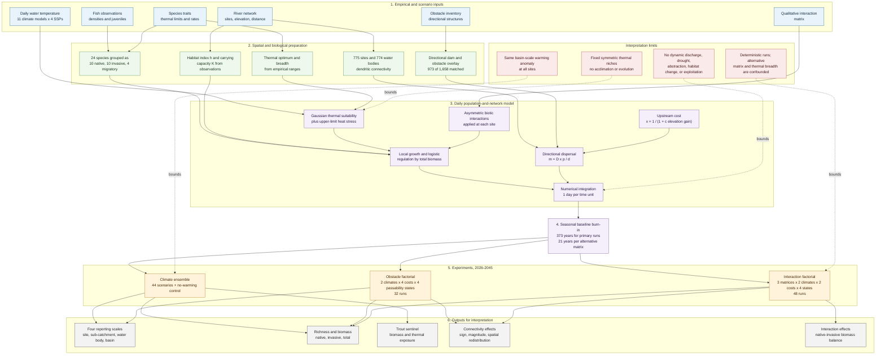

# Thermal Change, Network Fragmentation, and Biotic Structure in a Mediterranean Fish Metacommunity

## An integrated modelling study of climate sensitivity and obstacle--interaction effects in the Guadalquivir River Basin

**Manuscript version:** September 2026

**Study period:** 2026--2045

## Abstract

Mediterranean river fish communities are exposed simultaneously to warming, dendritic habitat fragmentation, and biological invasions. The ecological consequences of these pressures cannot be inferred from climate forcing alone because the ability of populations to persist and track suitable conditions depends on network connectivity and biotic interactions. We used a deterministic, spatially explicit metacommunity model of the Guadalquivir River Basin, southern Spain, to quantify the relative influence of thermal forcing, upstream movement costs, obstacle passability, and interaction structure. The model represented 775 sites, 24 fish species, daily site-level water temperature, species-specific thermal performance, asymmetric biotic interactions, and directional dispersal through a dendritic network. We synthesised a climate ensemble of 44 combinations of 11 general circulation models and four Shared Socioeconomic Pathways, a no-warming control, a 32-run obstacle factorial experiment, and a 48-run interaction-structure experiment.

Over 2026--2045, basin-mean warming reached 0.74--0.97 °C across emission scenarios. Aggregate total biomass declined weakly with warming (−0.120 model units per °C; R² = 0.25), whereas native richness was effectively unchanged (−0.00071 species per site per °C; R² = 0.02). The weak aggregate response resulted from opposing species-level thermal responses: dominant native cyprinids had optima above current basin temperature, while brown trout (*Salmo trutta*) was already on the warm side of its optimum. Trout biomass declined by 9.0--10.9% across scenarios, compared with 0.2% in the control, and declined at approximately 9.2% of baseline biomass per °C of warming (R² = 0.65). In the obstacle experiment, upstream movement cost was the principal control of aggregate native biomass, while climate was the principal control of trout biomass. The effect of passability was non-monotonic: blocking barriers reduced native biomass when background upstream cost was low but increased basin-mean native biomass when upstream cost was high. An invasive-favouring interaction matrix produced the largest structural effect, reducing native biomass by approximately 90% while increasing invasive biomass nearly tenfold; this contrast is a bounding scenario rather than an empirical uncertainty estimate because it was deliberately extreme and confounded with a shorter burn-in and narrower thermal niches.

The results indicate that, over this early-warming horizon, community-level indicators are more strongly controlled by network hydraulics and interaction structure than by approximately 1 °C of warming. Warming nevertheless produces an early and diagnostically useful decline in a cold-water specialist. Connectivity interventions should therefore be evaluated jointly with background network resistance and invasive pressure rather than under the assumption that increased passability always improves aggregate native outcomes.

**Keywords:** Mediterranean rivers; dendritic ecological networks; metacommunity; climate warming; fish passage; fragmentation; biological invasions; *Salmo trutta*; thermal niches; sensitivity analysis

## 1. Introduction

Riverine metacommunities are structured by the interaction of local environmental filtering, biotic interactions, demographic regulation, and dispersal through branching networks. This combination is especially consequential in Mediterranean basins, where endemic fish assemblages occupy hydrologically variable and increasingly regulated systems. Dams, weirs, culverts, and other transverse structures interrupt longitudinal movement, while warming alters the suitability of reaches and the physiological balance among species. Invasive species can further modify these responses by changing competition and predation within local communities.

The Guadalquivir River Basin provides a useful model system for studying these coupled pressures. It is a large, strongly regulated Mediterranean basin with high Iberian freshwater endemism and a fish assemblage containing native residents, invasive taxa, and migratory species. Its river network is dendritic, so movement is constrained to connected channels and is directionally affected by elevation. Fragmentation can therefore change not only the amount of movement but also the spatial distribution of demographic rescue and colonisation.

Three questions motivate this study:

1. How strongly does projected warming between 2026 and 2045 alter aggregate community biomass and richness relative to a stationary seasonal control?
2. How do upstream movement cost and local obstacle passability influence native, invasive, and total biomass across a dendritic network?
3. Does the structure of biotic interactions alter the apparent sensitivity of the community to climate and connectivity, and which species provide the earliest indication of thermal change?

We address these questions with a common spatially explicit model and three complementary experiments. The first isolates the climate response across a multi-model, multi-scenario ensemble. The second evaluates obstacle passability and upstream movement cost at two climate endpoints. The third evaluates alternative interaction structures and a thermal-breadth contrast. We use the experiments to distinguish robust mechanistic results from effects that are conditional on deliberately perturbed model structure.

## 2. Materials and Methods

### 2.0 Modeling workflow

The diagram below summarises how empirical observations and scenario forcing are converted into local population dynamics, network movement, experiments, and management-relevant outputs. It also makes explicit which assumptions bound interpretation.

### 2.1 Study system and biological representation

The model domain comprises one Guadalquivir basin represented by 775 sampling sites connected through a dendritic river network. For spatial reporting, sites are also aggregated into 774 water bodies, sub-catchments, and the basin as a whole. The simulated assemblage contains 24 species: 10 native residents, 10 invasive species, and four migratory or diadromous taxa. Migratory taxa were retained in the dynamical system and contributed to total biomass, but were excluded from the native-richness indicator because their estuarine or marine life histories are not fully represented by the modelled freshwater corridor.

The native resident group comprised *Aphanius baeticus*, *Anaecypris hispanica*, *Squalius pyrenaicus*, *Pseudochondrostoma willkommii*, *Luciobarbus sclateri*, *Squalius alburnoides*, *Iberochondrostoma lemmingii*, *Cobitis paludica*, *Iberochondrostoma oretanum*, and *Salmo trutta*. The invasive group comprised *Gambusia holbrooki*, *Micropterus salmoides*, *Lepomis gibbosus*, *Cyprinus carpio*, *Carassius gibelio*, *Ameiurus melas*, *Oncorhynchus mykiss*, *Esox lucius*, *Gobio lozanoi*, and *Tinca tinca*. The migratory group comprised *Anguilla anguilla*, *Alburnus alburnus*, *Liza ramada*, and *Mugil cephalus*. The classification of *Alburnus alburnus* as migratory rather than invasive remains a data-quality issue and should be resolved before interpreting invasive-biomass estimates as final.

### 2.2 Local population dynamics

For site *i* and species *s*, population density, denoted by \(N_{i,s}\), follows

$$
\frac{dN_{i,s}}{dt} = N_{i,s}\left[r_s W_{i,s}\left(1-\frac{\sum_j N_{i,j}}{K_i}\right) + \frac{\sum_j \alpha_{sj}N_{i,j}}{K_i} - m^{\mathrm{heat}}_{i,s}(t)\right]
 + \sum_{j\in\mathrm{nb}(i)}\left(m^s_{ji}N_{j,s}-m^s_{ij}N_{i,s}\right).
$$

The first term represents local density-dependent growth and biotic interactions; the second represents net dispersal. \(K_i\) is the site carrying capacity for total biomass, \(r_s\) is the species-specific intrinsic growth rate, and \(\alpha_{sj}\) is the effect of species *j* on species *s*. Carrying capacity was scaled to 1× observed total density, with a minimum-capacity floor for sparsely occupied sites. Species present at a site received their full growth rate; absent species received 10% of the rate to permit colonisation.

Environmental suitability was defined as

$$
W_{i,s}(t) = \exp\left[-\frac{(T_i(t)-T_s^*)^2}{2\sigma_s^2}\right]h_i,
$$

where \(T_i(t)\) is daily site temperature, \(T_s^*\) is the species thermal optimum, \(\sigma_s\) is thermal breadth, and \(h_i\) is a static habitat-suitability index bounded between 0.1 and 1.0. Thermal optima were set to the midpoint of the empirical temperature range and thermal breadth to one-sixth of that range. Thus, the thermal response is a fixed, symmetric Gaussian with no acclimation, plasticity, evolution, or frequency-dependent thermal adaptation.

Heat stress was represented separately from the Gaussian suitability term:

$$
m^{\mathrm{heat}}_{i,s}(t) = k\,\max\left(0,T_i(t)-T^{\mathrm{up}}_s\right)^2,
$$

where \(T^{\mathrm{up}}_s\) is the empirical upper thermal limit and \(k = 3.7817692640400324\times10^{-5}\) day⁻¹ °C⁻². The shared coefficient was calibrated so that the most exposed species--site combination under baseline climate lost no more than 5% of annual survival. No cold-stress mortality term was included. Negative densities were projected to zero during numerical integration.

Intrinsic growth rates were derived from literature annual rates and converted to daily rates. Species observed at a site received their full rate, whereas absent species received 10% of the rate to permit colonisation. The habitat term \(h_i\) was derived from the trophic-state index and held constant through each simulation. The system was integrated with an adaptive fifth-order Runge--Kutta method (`Tsit5`) using relative and absolute tolerances of \(10^{-6}\); a positivity callback projected negative densities to zero after each step. No stochastic replicate runs or exploitation-pressure scenarios were included in the experiments reported here.

### 2.3 Dendritic dispersal and obstacle representation

Movement from site *i* to site *j* was defined as

$$
m_{ij}=D_{\mathrm{median}}\frac{x_{ij}p_{ij}}{d_{ij}},
$$

where \(D_{\mathrm{median}}\) is the median dispersal speed (approximately 0.0274 km day⁻¹), \(d_{ij}\) is hydrological distance, \(x_{ij}\) is the elevation-dependent movement factor, and \(p_{ij}\) is directional passability. Species-specific dispersal rates were obtained by multiplying this base rate by literature-derived relative dispersal scalars.

Downstream or level movement was assigned \(x_{ij}=1\). For upstream movement,

$$
x_{ij}=\frac{1}{1+c\Delta e},
$$

where \(c\) is the global upstream movement cost and \(\Delta e\) is the elevation gain. The upstream cost therefore represents network-wide hydraulic resistance, whereas passability represents the local resistance of an individual restricted link.

The obstacle overlay was based on a 2026 inventory of 1,658 non-completely-passable structures. Of these, 973 were spatially matched to a modelled network segment within 2,000 m. Matched links had base upstream passability of 0.1 and downstream passability of 0.5. Four passability states were tested: baseline (multiplier 1.0), improved (1.5), reduced (0.5), and blocked (0.1), with passability capped at 1.0. The effective directional passability was the more restrictive value from the existing dam representation and the obstacle overlay.

The network was constructed from hydrological distances by connecting adjacent sites within sub-catchments and linking outlet sites across sub-catchments. Species-specific dispersal scalars were normalised to a median species, with migratory taxa generally above five times the median and sedentary taxa below 0.1 times the median. The obstacle and dam overlays were applied directionally; equal-elevation links were not assigned a flow direction by the obstacle overlay and therefore remained unrestricted by that component.

### 2.4 Thermal forcing and initial conditions

Climate simulations used daily site-level water-temperature series for 11 general circulation models under four emission pathways: SSP1-2.6, SSP2-4.5, SSP3-7.0, and SSP5-8.5. Anomalies were calculated relative to the 1986--2005 baseline and added to each site's observed absolute temperature. The no-warming control repeated the baseline seasonal climatology through 2045. All sites received the same basin-scale warming anomaly; elevation scaling of the anomaly was not applied.

Two warming quantities were kept distinct. The climate ensemble used the imposed basin-mean warming curve at 2045 for dose--response analysis and scenario comparison. The obstacle experiments used the maximum across sites of the final-year annual-mean anomaly to select two endpoint runs: the coolest endpoint (SSP1-2.6 with IITM-ESM) and the warmest endpoint (SSP2-4.5 with UKESM1-0-LL). These site-maximum endpoint anomalies are not interchangeable with the basin-mean climate-ensemble axis because the scenario products retain different pre-2026 offsets.

Each simulation began from a seasonal baseline burn-in rather than directly from the observed snapshot. The climate ensemble and obstacle experiment used a converged 373-year burn-in. The alternative-interaction experiment used a 21-year burn-in for each interaction matrix; this difference is an important source of confounding and limits the interpretation of that experiment.

### 2.5 Experimental design

The climate experiment comprised 44 deterministic scenario runs (11 climate models × four emission pathways) and one no-warming control. The obstacle experiment was a balanced factorial design with two climate endpoints, four upstream costs (0.01, 0.05, 0.10, and 0.50), and four passability states, for 32 runs. The alternative-interaction experiment comprised three interaction matrices × two climate endpoints × two upstream costs (0.01 and 0.50) × four passability states, for 48 runs. All scenarios covered 2026--2045.

The original interaction matrix was derived from qualitative species-interaction information. The random matrix was a placebo matrix with uniformly distributed off-diagonal values between −1 and 0. The invasive-favouring matrix was a deliberate worst-case contrast: invasive species suppressed natives at −0.8, natives had no effect on invasives, invasive--invasive competition was −0.3, and native--native competition was −0.1. In the alternative-interaction experiment, all matrices were also paired with a thermal-breadth multiplier of 0.3. Consequently, interaction structure, thermal breadth, and burn-in duration cannot be separated statistically in that experiment.

For the original matrix, qualitative interaction categories were mapped to coefficients of −1.0 (no coexistence), −0.8 (displacement), −0.5 (predation), −0.3 (competition or interference), −0.2 (weak effect), and 0.0 (coexistence or neutrality). The random placebo used a fixed seed (42) for reproducibility, but its relative biomass ratios are not ecologically interpretable.

**Table 1. Summary of the simulation design.**

| Component | Specification |
|---|---|
| Spatial domain | Guadalquivir basin; 775 sites and 774 water bodies |
| Assemblage | 24 species: 10 native residents, 10 invasive, 4 migratory/diadromous |
| Simulation horizon | 2026--2045; daily integration and annual reporting |
| Climate ensemble | 11 climate models × 4 SSPs = 44 scenarios, plus a no-warming control |
| Obstacle experiment | 2 climate endpoints × 4 upstream costs × 4 passability states = 32 runs |
| Interaction experiment | 3 interaction matrices × 2 climate endpoints × 2 upstream costs × 4 passability states = 48 runs |
| Upstream costs | 0.01, 0.05, 0.10, and 0.50 in the obstacle experiment; 0.01 and 0.50 in the interaction experiment |
| Passability states | Baseline, improved, reduced, and blocked |
| Baseline equilibration | 373-year seasonal burn-in for the climate and obstacle experiments; 21 years per matrix in the interaction experiment |
| Carrying capacity | 1× observed total density, with a minimum-capacity floor; mean modelled \(K\) ≈ 86.6 versus observed mean ≈ 84.4 |
| Heat stress | Shared quadratic exceedance mortality coefficient calibrated to a maximum 5% baseline annual loss |

### 2.6 Response variables and analysis

Outputs were summarised at site, sub-catchment, water-body, and basin scales. Richness was the number of species exceeding 0.1 density units, averaged over units at each spatial scale. Native, invasive, and total biomass were calculated as sums of species densities. The native richness-loss indicator was

$$
\max\left(0,1-\frac{R(t)}{R_0}\right),
$$

where \(R_0\) is richness in the spun-up baseline. This is a realised loss metric, not an extinction probability. Thermal exposure was quantified as days above each species' upper thermal limit and annual squared exceedance energy.

The quasi-extinction diagnostic flagged a site when a species remained below \(\max(0.1, 0.1\times\text{baseline density})\) for three consecutive annual observations. It was not used as a primary climate outcome because the fraction was already near saturation for brown trout at baseline and therefore primarily reflected the threshold's treatment of a rare but persistent species. Species-level trout climate responses were reconstructed from per-run species outputs because the aggregate climate index did not contain trout-specific metrics.

Climate dose--response relationships were estimated by ordinary least squares of final-year basin metrics against imposed basin-mean warming across the 44 scenario runs, excluding the control. Sensitivity effect sizes were calculated as the median within-block span across a factor's levels, standardised by the run-set standard deviation. Balanced within-experiment sum-of-squares decompositions were used to describe factor contributions. No formal significance testing was performed; reported effect sizes and sums of squares are descriptive.

## 3. Results

### 3.1 Climate forcing and aggregate community response

Added basin-mean warming by 2045 was 0.74 °C under SSP1-2.6, 0.87 °C under SSP2-4.5, 0.88 °C under SSP3-7.0, and 0.97 °C under SSP5-8.5. Across individual climate-model and pathway combinations, the basin-mean warming axis spanned approximately 0.28--1.37 °C. Differences among climate models overlapped differences among emission pathways.

The no-warming control was nearly stationary over the 20-year horizon: total biomass changed by +0.08%, native biomass by +0.10%, and native richness by −0.57%. The small residual drift is interpreted as a remaining internal cycle rather than a climate response. Across climate scenarios, total biomass declined by −0.120 model units per °C (R² = 0.25), equivalent to only about 0.13% of the approximately 92.7 model units per site at the warming extremes. Native richness declined by only −0.00071 species per site per °C (R² = 0.02). The realised richness-loss indicator was similarly flat (+0.00015 per °C; R² = 0.01) and did not exceed approximately 0.9% in any run.

The aggregate result was mechanistically explained by the distribution of thermal optima. The basin mean was approximately 16.0 °C. Most dominant native cyprinids had optima of 19--20 °C and therefore experienced improved Gaussian suitability under modest warming. Brown trout had an optimum of 12.0 °C and was already approximately 1.5 thermal standard deviations on the warm side of its optimum. Warming therefore moved the majority of native biomass towards, but trout away from, their optima.

**Table 2. Climate-ensemble response at basin scale.** Changes are final-year values relative to the spun-up state; dose--response slopes are fitted across the 44 warming scenarios.

| Quantity | No-warming control | Climate-ensemble response |
|---|---:|---|
| Added basin-mean warming by 2045 (°C) | 0.00 | 0.74 (SSP1-2.6), 0.87 (SSP2-4.5), 0.88 (SSP3-7.0), 0.97 (SSP5-8.5) |
| Total biomass change | +0.08% | −0.120 model units per °C; R² = 0.25 |
| Native biomass change | +0.10% | Weak negative response; no defensible pathway ranking |
| Native richness change | −0.57% | −0.00071 species per site per °C; R² = 0.02 |
| Native richness-loss indicator | <1% | +0.00015 units per °C; R² = 0.01; never > approximately 0.9% |
| Trout biomass change | −0.2% | −9.0% (SSP1-2.6), −9.7% (SSP2-4.5), −9.5% (SSP3-7.0), −10.9% (SSP5-8.5) |

The corresponding climate dose--response slopes were −0.120 model units per °C for total biomass, −0.00071 species per site per °C for native richness, and +0.00015 richness-loss units per °C. These slopes are descriptive and should not be interpreted as formal significance tests.

### 3.2 Brown trout as a thermal--hydraulic sentinel

Brown trout was the only species with a large, directionally reproducible climate response. Basin trout biomass declined by 9.0% under SSP1-2.6, 9.7% under SSP2-4.5, 9.5% under SSP3-7.0, and 10.9% under SSP5-8.5, compared with 0.2% in the control; individual climate-model responses spanned roughly 4--19% declines. Across the climate ensemble, trout biomass declined by approximately 9.2% of baseline biomass per °C of warming (R² = 0.65). At occupied sites, median population size fell to approximately 68--92% of its 2026 value, depending on scenario.

Thermal exposure increased consistently with warming. The maximum number of days per year above the 20 °C upper limit increased from 131 under baseline conditions to 139--174 across scenario runs. Maximum squared exceedance energy increased from approximately 1.6 × 10³ to 2.1--4.2 × 10³ °C² day. Trout therefore provided the clearest link between the imposed forcing and a physiological mechanism.

The obstacle experiment showed that trout remained climate-dominated but was also sensitive to network structure. At upstream cost 0.05, final trout biomass declined from 803.9 to 770.9 model units when passability changed from baseline to blocked under the cool climate endpoint, and from 725.0 to 704.2 units under the warmer endpoint. At the warm endpoint, relative change was −13.6% under baseline passability, −12.8% under improved passability, −14.7% under reduced passability, and −16.1% under blocked passability.

Trout occupies only approximately 4% of sites. Its large relative decline is therefore diluted in basin-wide richness and biomass. It is best interpreted as an early-warning indicator of thermal--hydraulic coupling, not as a proxy for whole-community vulnerability. The sign of its response is robust within the tested structure, but its magnitude depends strongly on the assumed thermal breadth and optimum.

### 3.3 Hydraulic controls and the passability sign reversal

Across eight response metrics, the mean factor ranking was interaction matrix (1.88) > upstream cost (3.00) ≈ thermal breadth (3.12) > passability (3.62) > passability × upstream cost (4.38) > climate endpoint (5.00) > passability × temperature (7.00). The passability × temperature interaction had a median standardised magnitude no greater than 0.15 standard deviations for every metric except the near-saturated trout quasi-extinction flag, where it reached 1.24. Because the climate endpoint was an external reference axis in the obstacle experiment, these ranks should not be interpreted as a joint analysis of all 44 climate runs.

For native biomass in the obstacle experiment, upstream cost explained the largest sum of squares (SS = 0.578), followed by the passability × upstream-cost interaction (SS = 0.242), passability (SS = 0.155), and climate endpoint (SS = 0.026). For trout final biomass, the ordering was different: climate endpoint explained SS = 0.886, passability SS = 0.090, and upstream cost SS = 0.011. Total biomass and native richness were similarly dominated by upstream cost, with SS = 0.961 and 0.947, respectively. Invasive biomass also responded primarily to upstream cost (SS = 0.970).

**Table 3. Principal within-experiment variance contributions.** Sums of squares are fractions of the corresponding balanced factorial decomposition and are descriptive rather than inferential.

| Response | Dominant factor | Dominant SS | Other notable contributions |
|---|---|---:|---|
| Total biomass | Upstream cost | 0.961 | Climate endpoint: 0.006 |
| Native biomass | Upstream cost | 0.578 | Passability × cost: 0.242; passability: 0.155; climate endpoint: 0.026 |
| Native richness | Upstream cost | 0.947 | Climate endpoint: approximately 0 |
| Invasive biomass | Upstream cost | 0.970 | Interaction structure is also large in the alternative sweep |
| Trout final biomass | Climate endpoint | 0.886 | Passability: 0.090; upstream cost: 0.011 |

The passability effect changed sign with background upstream cost. At the cool climate endpoint, the blocked-minus-baseline difference in basin native biomass was −0.349 at upstream cost 0.01, −0.009 at 0.05, +0.146 at 0.10, and +0.442 at 0.50. The warm endpoint showed the same pattern, from −0.336 to +0.453. Reduced passability showed the same reversal, whereas improved passability reduced basin native biomass at every upstream cost (from −0.034 at cost 0.01 to −0.407 at cost 0.50).

The reversal was also spatially heterogeneous. At high upstream cost, the positive basin-level blocked-minus-baseline effect was a net result of positive and negative changes among sub-catchments and water bodies. Blocking did not uniformly benefit native fish; it redistributed biomass across the network. The mechanism cannot be uniquely separated into loss of native immigration, reduced emigration, and suppression of invasive dispersal with the available outputs. The robust result is that the sign of a passability intervention depends on background network resistance.

### 3.4 Interaction structure and native--invasive redistribution

The alternative-interaction experiment produced the largest contrast among tested factors. The invasive-favouring matrix reduced pooled native biomass from approximately 50.2 to 5.1 model units, native richness from 2.42 to 0.15 species per site, and trout biomass from approximately 548 to 313 units. In the matched cool-end, low-cost, baseline-passability contrast, native biomass changed from approximately 51.0 to 5.2 units and trout biomass from approximately 575 to 314 units. Invasive biomass increased from approximately 6.0 to 58.7 units, while total biomass changed comparatively little, from approximately 56.2 to 64.2 units. This pattern indicates redistribution of biomass among community compartments rather than uniform loss of the total resource base. The confounded thermal-breadth contrast itself shifted native biomass downward by approximately 36.9--38.8% and trout biomass by approximately 27.0--30.3%, but these changes cannot be attributed to thermal breadth alone.

The interaction matrix accounted for SS = 0.998 of native biomass and SS = 0.982 of trout biomass within the alternative sweep. Passability spans were also interaction-dependent: trout showed the largest passability span under the invasive-favouring matrix, whereas native-biomass spans were smallest after native biomass had already collapsed. The passability sign reversal observed in the primary obstacle sweep was not recovered consistently in the alternative sweep. However, these comparisons are not empirical estimates of uncertainty. The invasive-favouring matrix was deliberately extreme, the random matrix was a placebo with near-zero burn-in baselines for some species, and the alternative sweep used a 0.3 thermal-breadth multiplier and a 21-year burn-in rather than the 373-year burn-in used elsewhere. The defensible interpretation is that interaction structure could dominate outcomes under strong structural changes, not that the precise 90% loss or passability span is a forecast.

### 3.5 Other species and community-level indicators

Warm-adapted native cyprinids and most invasive and migratory taxa changed little over the study horizon. Their empirical upper thermal limits were generally 25--30 °C and were rarely exceeded, so the heat-stress mortality term was inactive. No warming-driven invasive expansion was detected in the climate ensemble. Invasive richness and total richness were effectively invariant across climate scenarios and the control, with final-year basin means of approximately 0.217 and 2.72, respectively.

The apparent insensitivity of the aggregate community therefore reflected averaging across species with opposite thermal responses and unequal abundance. Aggregate richness was a poor indicator of specialist decline, while species-level biomass, thermal exposure, and the thermal selection gradient

$$
\frac{\partial\log W}{\partial T}=-\frac{T-T_s^*}{\sigma_s^2}
$$

were more informative for diagnosing climate sensitivity.

## 4. Discussion

### 4.1 Warming was weak at the aggregate scale but strong for a specialist

The climate ensemble sampled an early-warming interval. Approximately 1 °C of warming by 2045 was insufficient to produce a large change in aggregate richness because most of the native assemblage was cold-marginal relative to its assigned optimum. This does not imply that the community is broadly protected from warming. It indicates that aggregate metrics can conceal opposing responses, especially when a rare cold-water specialist is embedded in a numerically dominant warm-adapted assemblage.

The trout response was supported by three convergent diagnostics: a monotonic biomass decline across climate models, separation from the stationary control, and increased exposure above the empirical upper thermal limit. The result is therefore biologically interpretable within the model. It is not, however, a prediction of basin-scale extinction. Trout was already thermally stressed under baseline conditions, and its projected decline is conditional on a fixed Gaussian niche, midpoint thermal optimum, and unvaried thermal breadth.

### 4.2 Connectivity is context dependent

The sign reversal in the passability effect challenges a simple interpretation of connectivity restoration as uniformly beneficial to native biomass. At low upstream movement cost, blocking a link removed movement and reduced native biomass. At high cost, further blocking was associated with a higher basin-average native biomass, plausibly because it restricted movement by competitively effective invasive taxa or reduced net losses from isolated native units. The present design cannot discriminate among these mechanisms.

This result should not be used to justify barrier construction or blanket reductions in connectivity. It instead demonstrates that barrier decisions need to be evaluated at the reach and sub-catchment scales, against background hydraulic resistance, species composition, and invasive pressure. Basin means can conceal local losses and gains, and the positive aggregate effect at high upstream cost was explicitly a spatial redistribution rather than a uniform improvement.

### 4.3 Interaction structure is a major structural uncertainty

The interaction matrix determined whether biomass was retained by native or invasive compartments in the deliberately perturbed experiment. This result is ecologically important because warming and fragmentation can alter the competitive balance even when total biomass changes little. It is also methodologically limited. The invasive-favouring matrix was a worst-case construction, the random matrix was not a plausible alternative community, and thermal breadth and burn-in differed between the alternative sweep and the primary experiment.

Future inference should replace these bounding contrasts with empirically estimated interaction coefficients, uncertainty distributions, and independent replication across interaction and thermal-parameter sets. Until then, the interaction experiment is best used to identify a high-leverage uncertainty, not to quantify a probability of invasive takeover.

### 4.4 Implications for monitoring and management

Monitoring based only on aggregate richness or biomass is unlikely to detect early thermal deterioration in this system. Cold-water specialists should be monitored with species-level abundance, occupancy, upper-limit exceedance, and thermal selection gradients. Brown trout is a useful sentinel because warming and restricted movement act in the same direction for a sparse, headwater-associated population.

Connectivity interventions should be prioritised using spatially explicit assessments that combine local passability, upstream cost, species movement traits, and invasive distributions. Barrier removal may provide demographic rescue in some reaches but may also facilitate invasive expansion or redistribute biomass away from vulnerable native units. Thermal refugia, especially high-elevation and headwater reaches, should be protected alongside connectivity improvements.

The model also identifies processes requiring explicit inclusion before management forecasts are attempted: discharge and drought dynamics, water abstraction, flow-dependent habitat change, land-use degradation, age structure, harvesting, and evolution or acclimation. These processes are plausibly first-order controls in a Mediterranean basin and are not represented by the current static habitat index and temperature-only forcing.

## 5. Limitations and Scope of Inference

1. The climate and sensitivity experiments were separate designs. Within each experiment, factorial decompositions were balanced; across experiments, factors cannot be pooled into a single orthogonal analysis.
2. The thermal-breadth contrast was confounded with interaction structure and burn-in duration. It should not be interpreted as the isolated effect of thermal breadth.
3. The random interaction matrix was a placebo and its relative biomass ratios are not ecologically interpretable.
4. The invasive-favouring matrix was deliberately extreme and should be treated as a bounding scenario, not a forecast or probability distribution.
5. No formal significance tests or replicate stochastic simulations were performed. All effect sizes are descriptive, and biomass is expressed in model units rather than calibrated field biomass.
6. Thermal optima and breadths were derived heuristically from empirical ranges. The midpoint optimum and range/6 breadth convention were not fully calibrated against thermal-performance curves.
7. The model assumes fixed, symmetric thermal niches and excludes evolution, acclimation, plasticity, and alternative selection modes.
8. All sites received the same basin-scale warming anomaly. Spatial differences in warming among elevation zones and reaches were not resolved.
9. The model did not dynamically represent discharge, drought, water abstraction, land-use change, or flow-dependent habitat quality.
10. The richness-loss indicator is a realised threshold-based loss and not an extinction probability. The trout quasi-extinction fraction was near saturation (approximately 0.956--0.959 in the obstacle sweep and 0.935--0.972 in the alternative sweep) and was not used as a primary climate result. No warming-driven species extinction was demonstrated.
11. The 2026--2045 horizon cannot robustly rank emission pathways because climate-model spread overlapped pathway differences. Absolute temperature changes relative to 1986--2005 are also not directly comparable across scenario products because they retain different 2026 offsets; the imposed basin-mean warming curve is the appropriate comparison axis.
12. The 685 inventoried obstacles that were not matched to a modelled segment did not affect the simulated dispersal field.
13. The thermal optimum was fixed at the midpoint of each empirical range and was not varied. The sign of the response is determined by the optimum's position relative to ambient temperature, but the magnitude, and potentially the aggregate balance if optima are re-positioned, requires an optimum-position sensitivity analysis.
14. The classification of *Alburnus alburnus* requires verification before invasive-richness and invasive-biomass results are used for policy inference.
15. The converged baseline retains a small internal cycle: control changes below approximately 1% over 20 years are not interpretable as climate effects. The study therefore supports directional and species-level contrasts more strongly than sub-percent aggregate differences.

## 6. Conclusions

For the Guadalquivir metacommunity and the 2026--2045 horizon represented here, aggregate native biomass and richness were controlled primarily by network hydraulics and interaction structure, not by the approximately 1 °C of warming delivered by the climate ensemble. This weak aggregate response was not evidence of thermal safety: it resulted from cancellation between warm-adapted dominant natives and a cold-water specialist moving away from its optimum.

Brown trout provided the clearest early-warning signal, with a reproducible 9--11% climate-associated biomass decline and increased exposure to supra-optimal temperatures. Upstream movement cost was the main control of aggregate native biomass and richness, while climate was the main control of trout biomass. Passability effects were non-monotonic and changed sign with background upstream cost, demonstrating that connectivity interventions cannot be evaluated independently of network structure and community composition.

The strongest structural contrast arose from the invasive-favouring interaction matrix, which shifted biomass from native to invasive compartments while approximately conserving total biomass. Because that contrast was deliberately extreme and confounded with other design changes, it identifies a priority for empirical uncertainty reduction rather than a direct forecast. A defensible management strategy should combine species-level thermal monitoring, protection of cold-water refugia, spatially targeted connectivity assessment, and invasive-species control. Future simulations should extend the time horizon, calibrate thermal-performance parameters, and incorporate hydrology and habitat change before making quantitative extinction-risk projections.

## 7. Figure List and Captions

**Figure 1. Thermal niches and baseline temperatures.** The histogram shows the distribution of baseline site temperatures, while the overlaid curves show the Gaussian thermal suitability of each native species; vertical reference lines identify the basin mean and a representative warmed mean. Most dominant cyprinid optima lie to the warm side of the current temperature distribution, whereas *S. trutta* (optimum 12.0 $^\circ$C) is already on the warm side of its optimum by approximately 1.5 thermal standard deviations. The figure provides the mechanistic explanation for the weak aggregate climate response: modest warming improves suitability for the abundant warm-adapted majority but reduces suitability for the cold-water sentinel.

**Figure 2. Final-year climate ensemble summary.** Points and uncertainty intervals summarise native richness, invasive richness, realised native richness loss, total biomass, and mean water temperature at four nested reporting levels: sampling site, sub-catchment, water body, and basin. Across the 44 climate scenarios, temperature is the only indicator that clearly separates emission pathways; the aggregate richness and biomass indicators overlap strongly and the no-warming control remains within the scenario spread. The consistency across spatial scales shows that the aggregate insensitivity is not produced by a single noisy level of aggregation.

**Figure 3. Basin trajectories across emission pathways.** Annual basin trajectories from 2026 to 2045 are shown for each SSP, with lines representing ensemble means and bands representing across-climate-model variation; the no-warming control is shown separately. The temperature trajectories diverge as expected, but native richness, realised richness loss, and total biomass remain nearly coincident across pathways and the control is nearly stationary. The temporal persistence of this pattern supports interpreting the flat aggregate climate slopes as a model result rather than a transient caused by incomplete equilibration.

**Figure 4. Climate forcing and aggregate response.** The six panels pair warming trajectories with native richness and total biomass trajectories, final-year relationships between realised temperature change and aggregate indicators, and the realised richness-loss trajectory. The imposed forcing is clearly separated among SSPs while aggregate biological responses overlap, demonstrating that the weak signal is not a failure to transmit climate forcing through the model. The lower panels use realised final-year temperature change, which differs from the imposed basin-mean warming axis used for the ordinary least-squares dose--response slopes; the richness-loss metric is a thresholded realised loss, not an extinction probability.

**Figure 5. Basin response versus warming.** Each point is one of the 44 climate-model--SSP runs, coloured by emission pathway; dashed lines show ordinary least-squares fits of final-year basin total biomass, native richness, and realised richness loss against imposed basin-mean warming. The fitted slopes are $-0.120$ model units per $^\circ$C ($R^2=0.25$), $-0.00071$ species per site per $^\circ$C ($R^2=0.02$), and $+0.00015$ loss units per $^\circ$C ($R^2=0.01$), respectively. The warming range is approximately 0.28--1.37 $^\circ$C, and the overlap among pathway colours shows why no SSP ranking is defensible over this horizon.

**Figure 6. Factor importance.** The ranking panel orders factors by their mean rank across eight response metrics; the accompanying matrix displays standardised within-metric effect sizes based on median spans across matched factorial blocks. Interaction structure ranks first (mean rank 1.88; mean normalised effect 0.871), followed by upstream cost, thermal breadth, passability, the passability--cost interaction, the selected climate endpoint, and passability--temperature interaction. The climate endpoint is an external reference axis rather than a full climate-model factor, and the apparent importance of passability for trout quasi-extinction is partly affected by the near-saturated threshold diagnostic.

**Figure 7. Signed factor effects.** Tornado panels show the signed median effect of each non-reference factor level relative to its reference level, expressed in run-set standard deviations across the eight response metrics. Increasing upstream movement cost consistently suppresses most biomass and richness indicators; passability effects change direction with upstream cost; and the invasive-favouring interaction matrix has a much larger and more asymmetric effect than the random placebo. The downward effect of the thermal-breadth multiplier is shown for completeness but is confounded with the alternative interaction sweep and its shorter burn-in.

**Figure 8. Passability by upstream-cost interaction.** Heatmaps show raw changes from the same-model, same-cost baseline-passability run across four passability states and four upstream costs, separately for the cool and warm climate endpoints. For native biomass, blocked minus baseline changes from $-0.349$ at cost 0.01 to $+0.442$ at cost 0.50 at the cool endpoint, with the warm endpoint showing the same reversal ($-0.336$ to $+0.453$). Reduced passability follows the same pattern, whereas improved passability is negative at every cost. The figure demonstrates context-dependent connectivity effects but cannot by itself distinguish reduced native rescue from suppressed invasive dispersal.

**Figure 9. Trout response to hydraulic structure.** The panels show final *S. trutta* biomass and relative biomass change across upstream movement costs, with separate curves for baseline, improved, reduced, and blocked passability and facets for the cool and warm climate endpoints. All passability curves are negative relative to the spun-up state, and the warm endpoint is uniformly more negative. At cost 0.05, baseline-to-blocked biomass changes from 803.9 to 770.9 units at the cool endpoint and from 725.0 to 704.2 units at the warm endpoint; the figure therefore shows a climate penalty superimposed on a smaller but non-negligible hydraulic penalty.

**Figure 10. Passability robustness across interaction matrices.** Horizontal spans quantify the range of trout and native biomass produced by the four passability states for each interaction matrix, climate endpoint, and upstream cost. Trout passability spans are largest under the invasive-favouring matrix (mean approximately 23.8 units, versus 10.2 under the original matrix and 8.5 under the random placebo), whereas native-biomass spans are smallest after native biomass has collapsed under the invasive-favouring matrix (approximately 0.2 versus 1.3 and 1.4 units). The panel is a structural-uncertainty warning: both the magnitude and, in the confounded sweep, the sign of passability effects depend on interaction assumptions.

**Figure 11. Spatial distribution of blockage effects.** Maps and distributions show blocked-minus-baseline native biomass at sub-catchment and water-body scales for the warm endpoint and high upstream-cost configuration. The basin-level positive effect at high cost is a net of local gains and losses: some units gain native biomass while others lose it. This spatial decomposition prevents the aggregate sign reversal from being interpreted as a uniform benefit of blocking and identifies the sub-catchment or water-body as the more appropriate scale for management decisions.

**Figure 12. Trout climate dose--response.** The three panels relate imposed basin-mean warming across the 44 climate runs to trout relative biomass change, absolute final biomass, and maximum thermal exposure. Trout relative biomass declines at approximately 9.2% of baseline per $^\circ$C ($R^2=0.65$), while the no-warming control changes by only $-0.2\%$; maximum days above the 20 $^\circ$C upper limit increase from 131 in the control to 139--174 across scenarios, and squared exceedance energy also increases. The figure links a species-level abundance response to a physiological exposure mechanism while showing why the result should not be extrapolated to the whole assemblage.

**Figure 13. Interaction-matrix main effects.** Jittered points show run-level basin native biomass, invasive biomass, trout biomass, total biomass, and native richness for the original, random, and invasive-favouring matrices; bars show matrix means across climate endpoints and upstream costs. Relative to the original matrix, the invasive-favouring matrix shifts native biomass from approximately 50.2 to 5.1 units, trout biomass from 548 to 313, native richness from 2.42 to 0.15, and invasive biomass from 6.0 to 58.7, while total biomass changes comparatively little (56.2 to 64.2). The figure therefore shows redistribution between community compartments, but the extreme matrix, thermal-breadth multiplier, and shorter burn-in make it a bounding scenario rather than a forecast.

## 8. Data and Code Availability

The study is based on empirical fish-density and juvenile observations, site connectivity and environmental measurements, species trait data, qualitative interaction information, an inventory of transverse obstacles, and daily downscaled water-temperature projections for the Guadalquivir basin. Model code, input data, scenario forcing, derived outputs, and figure source data should be deposited in a persistent public repository at publication. The final manuscript should replace this statement with the repository accession, version identifier, licence, and any restrictions on sensitive spatial data.

## 9. Author Contributions and Funding

These sections should be completed for submission with author-specific contributions, funding acknowledgements, permits, ethical compliance, and conflict-of-interest declarations. Fish sampling and handling were conducted under the relevant Spanish regulatory framework.
